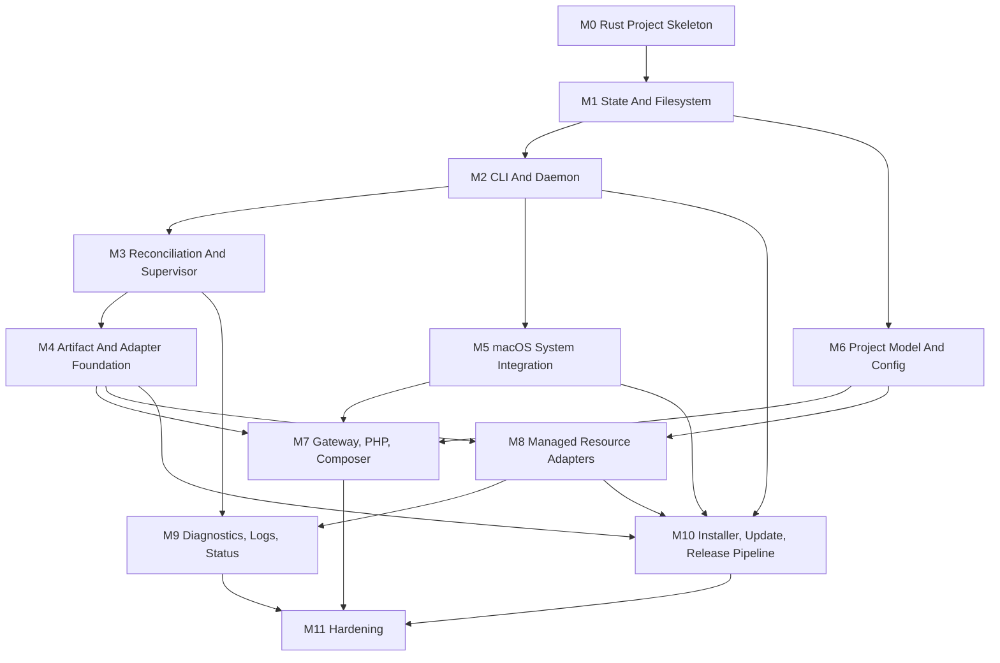

# PV Implementation Roadmap

This roadmap turns `DESIGN.md` into implementation-sized work packages. The goal is to keep PRs small, unblock parallel work, and avoid building every Managed Resource in one branch.

## Working Rules

- Build shared foundations first, then implement individual Managed Resources independently.
- Keep each PR focused on one foundation layer, one command group, or one Managed Resource adapter.
- Do not mix generic framework changes with a full adapter unless the framework change is tiny and only exists to finish that adapter.
- If an adapter needs a new shared capability, land the shared capability first, then update the adapter in a follow-up PR.
- Prefer vertical slices that can be tested from the CLI, even if the first version uses fake fixtures or local test processes.
- Every mutating command should have a non-happy-path test for invalid input, daemon unavailable behavior, or failed reconciliation where relevant.
- Terminology in code, CLI text, and docs should follow `CONTEXT.md`.

## Milestones

| Milestone | Name | Goal | Blocks |
| --- | --- | --- | --- |
| M0 | Rust Project Skeleton | Create the buildable Rust application and baseline quality gates. | Everything |
| M1 | State And Filesystem Foundation | Establish `~/.pv`, `pv.db`, migrations, permissions, and typed state access. | Daemon, setup, Project linking, Managed Resource framework |
| M2 | CLI And Daemon Foundation | Implement command routing, daemon mode, Unix socket IPC, job streaming, and daemon lifecycle basics. | Reconciliation, setup, Managed Resource jobs |
| M3 | Reconciliation And Supervisor Foundation | Build job queue, reconciliation scopes, process supervision, pid/runtime metadata, readiness, and port assignment. | Gateway, PHP workers, Managed Resources |
| M4 | Artifact And Adapter Foundation | Build manifest loading, downloads, atomic installs, adapter registry, and common Managed Resource interfaces. | Individual Managed Resource adapters |
| M5 | macOS System Integration | Implement DNS resolver integration, `pf` redirects, CA trust, LaunchAgent setup, and uninstall safety. | Full `pv setup`, browser-ready Projects |
| M6 | Project Model And Config | Implement `pv link`, Project config parsing, hostname validation, Resource allocation state, and env rendering. | Project-serving reconciliation, Resource allocations |
| M7 | Gateway, PHP, Composer | Implement Gateway, PHP-track workers, PHP shim, Composer 2, and Project routing. | First usable Project serving |
| M8 | Managed Resource Adapters | Implement MySQL, Postgres, Redis, Mailpit, and RustFS as separate adapter workstreams. | Complete Laravel-first backing Managed Resources |
| M9 | Diagnostics, Logs, Status | Implement `pv status`, `pv logs`, `pv doctor`, `pv jobs`, JSON status output, and degraded-state UX. | Release readiness |
| M10 | Installer, Update, Release Pipeline | Implement generated installer assumptions, PV application self-update, Managed Resource updates, artifact release tooling, artifact recipes, and release manifests. | Public distribution |
| M11 | Hardening And Release Candidate | End-to-end validation with published artifacts, failure-mode testing, docs pass, and release candidate checklist. | Public v1 |

## Critical Path

The shortest path to a browser-visible Project is:

`M0 -> M1 -> M2 -> M3 -> M4 -> M5 -> M6 -> M7`

Backing Managed Resources are not required for the first Project-serving MVP. MySQL, Postgres, Redis, Mailpit, and RustFS can start after `M4` and `M6` define the shared adapter and Resource allocation contracts.

The shortest path to full Laravel-first v1 is:

`M0 -> M1 -> M2 -> M3 -> M4 -> M5 -> M6 -> M7 -> M8 -> M9 -> M10 -> M11`

Managed Resource artifact release work is not on the browser-visible MVP path when tests use fixture artifacts and local manifests. It becomes blocking for public setup, public update, and release-candidate validation once PV must download real artifacts from PV-owned object storage.

Adapter PRs should not wait for the full object-storage publication pipeline. They can use fixture artifacts after M4. The corresponding artifact recipes can be built in parallel in M10 and become release blockers only when public distribution needs that resource.

## Dependency Graph



## Parallelization Gates

| Gate | What Must Be True | Work That Can Start After |
| --- | --- | --- |
| G1 | Rust crate, CI, command skeleton, and error handling exist. | State, CLI stubs, local shell commands |
| G2 | `pv.db`, migrations, filesystem layout, and state transactions exist. | Project linking, daemon job metadata, Managed Resource install state |
| G3 | Daemon socket protocol and job queue exist. | Setup, long-running install/update jobs, status plumbing |
| G4 | Supervisor, port allocator, readiness checks, and log paths exist. | Gateway/PHP workers and backing Managed Resource runtimes |
| G5 | Artifact manifest, downloader, atomic install, and adapter registry exist. | MySQL, Postgres, Redis, Mailpit, RustFS, PHP/FrankenPHP, Composer adapters |
| G6 | Project config and Resource allocation schema exist. | Resource allocation implementation per adapter |
| G7 | Gateway + PHP workers can serve linked Projects. | End-to-end Project tests, Managed Resource-backed Project scenarios |
| G8 | Artifact release tooling and common packaging/validation harness exist. | Per-resource artifact recipes and object-storage publication workflows |
| G9 | Published artifacts exist for the default setup matrix. | Public setup/update hardening and release-candidate validation |

## Work Packages

### M0: Rust Project Skeleton

| ID | Package | Type | Blocked By | Blocks | Done When |
| --- | --- | --- | --- | --- | --- |
| PV-000 | Create Rust binary project | Enabler | None | All Rust work | `pv --version` builds and runs from source. |
| PV-001 | Add baseline workspace crate layout | Enabler | PV-000 | CLI, daemon, state | Project has internal workspace crates for `cli`, `daemon`, `state`, `config`, `resources`, and `macos`. |
| PV-002 | Add CI quality gates | Enabler | PV-000 | Safe parallel work | CI runs format, Clippy with PV's lint policy, Nextest, and docs checks. |
| PV-003 | Add error/output conventions | Enabler | PV-000 | CLI UX | Shared error type, exit handling, color/no-color helper, and user-facing output helpers exist. |
| PV-004 | Add workspace lint policy | Enabler | PV-000 | Safe parallel work | Cargo lint settings enable the root `clippy.toml` policy for disallowed methods, types, macros, print/debug output, unwrap/expect, panic, todo, unimplemented, and unreachable code. |

Recommended external crates for this milestone: `clap`, `tokio`, `serde`, `serde_json`, `thiserror`, `anyhow`, `tracing`, `tracing-subscriber`, `camino` or strict path helpers, and test helpers.

Use `thiserror` for crate/domain error types and `anyhow` only at binary/orchestration boundaries. Domain crates should return typed errors, not `anyhow::Result`. CLI command handlers, daemon job entrypoints, setup/update orchestration, release tooling, and tests may use `anyhow` to add context and convert typed errors into user-facing reports.

Use a simple Cargo workspace with internal crates. These crates do not need a `pv-` prefix because they are not intended for publishing.

```text
crates/
  cli/
  daemon/
  state/
  config/
  resources/
  macos/
```

Release tooling may later live in `xtask/` or an internal `crates/release/` crate. It is not part of the user-facing `pv` binary.

Suggested crate ownership:

| Crate | Owns |
| --- | --- |
| `cli` | `clap` command definitions, command dispatch, terminal output, shell env/completions, and client-side command behavior. |
| `daemon` | Daemon entrypoint, Unix socket server, job queue, reconciliation orchestration, supervision, watchers, and progress streaming. |
| `state` | `pv.db`, migrations, transactions, typed queries, desired/observed state, jobs, ports, Projects, and Managed Resource state. |
| `config` | `pv.yml` parsing, validation, hostnames, document roots, env mappings, placeholder validation, and allocation config shape. |
| `resources` | Compiled-in Managed Resource adapter traits, registry, artifact lifecycle helpers, allocation contracts, and common resource command plumbing. |
| `macos` | macOS-specific integrations: LaunchAgent, `/etc/resolver/test`, `pf`, System keychain CA trust, shell profile targets, and privileged command helpers. |
| `xtask` or `release` | Internal release tooling for artifact metadata validation, manifest generation, checksums, revocations, and publication planning. |

Keep crate boundaries practical. If a boundary starts slowing development down, prefer moving code within the workspace over introducing another crate.

### M1: State And Filesystem Foundation

| ID | Package | Type | Blocked By | Blocks | Done When |
| --- | --- | --- | --- | --- | --- |
| PV-010 | Implement PV path layout | Enabler | M0 | Setup, state, logs, artifacts | `~/.pv` paths are centralized and testable without touching the real home directory. |
| PV-011 | Implement filesystem permissions helpers | Enabler | PV-010 | Setup, CA, state | PV can create and validate user-owned directories/files with expected modes. |
| PV-012 | Implement SQLite connection and migrations | Enabler | PV-010 | All stateful commands | `pv.db` opens with WAL, foreign keys, migration table, and transactional migration runner. |
| PV-013 | Implement migration backups | Enabler | PV-012 | Self-update safety | Backups are created only before migrations and retained according to policy. |
| PV-014 | Define core state schema | Enabler | PV-012 | Projects, Managed Resources, daemon jobs | Tables exist for Projects, hostnames, Managed Resource tracks, Resource allocations, ports, observed state, jobs, and migrations. |
| PV-015 | Implement state transaction API | Enabler | PV-014 | CLI/daemon shared writes | CLI and daemon can use the same state library with short busy timeout behavior. |

Keep this milestone independent of daemon implementation. Unit tests should use temporary PV homes and temporary SQLite databases.

### M2: CLI And Daemon Foundation

| ID | Package | Type | Blocked By | Blocks | Done When |
| --- | --- | --- | --- | --- | --- |
| PV-020 | Implement colon command routing | Enabler | M0 | All commands | Public commands use literal names like `php:install`; space-separated aliases are rejected. |
| PV-021 | Implement global flags and output mode | Enabler | PV-020 | All commands | `--no-color`, `NO_COLOR`, and basic human output are handled consistently. |
| PV-022 | Implement `pv env` | Story | PV-020 | Installer shell integration | `pv env --shell zsh|bash|fish` is fast, local, daemon-free, and idempotent. |
| PV-023 | Implement `pv completions` | Story | PV-020 | Shell UX | zsh, bash, and fish completions can be generated. |
| PV-024 | Implement hidden `daemon:run` | Enabler | PV-020, M1 | Daemon lifecycle | The same binary can run foreground daemon mode and initialize logging/state. |
| PV-025 | Implement Unix socket NDJSON protocol | Enabler | PV-024 | Job streaming, CLI-daemon commands | CLI can send versioned requests and receive immediate responses plus progress events. |
| PV-026 | Implement daemon job model and progress stream | Enabler | PV-025 | Setup, install/update commands | Long-running jobs persist metadata/final status and stream live progress. |
| PV-027 | Implement daemon lifecycle commands | Story | PV-024, PV-025 | Setup, update | `daemon:enable`, `daemon:disable`, and `daemon:restart` manage the LaunchAgent at a stub/minimal level first. |

The LaunchAgent-specific file generation can start here but final macOS integration belongs in M5.

### M3: Reconciliation And Supervisor Foundation

| ID | Package | Type | Blocked By | Blocks | Done When |
| --- | --- | --- | --- | --- | --- |
| PV-030 | Implement reconciliation queue | Enabler | M2 | Setup, Managed Resources, Projects | Daemon accepts requests, coalesces by scope, and runs one reconciliation job at a time. |
| PV-031 | Implement reconciliation scopes | Enabler | PV-030 | Targeted Project/Managed Resource work | `system`, `project:<id>`, and `resource:<name>:<track>` scopes are modeled. |
| PV-032 | Implement port allocator | Enabler | M1 | Gateway, DNS, Managed Resources | Preferred ports, fallback range, persisted assignments, and collision checks work. |
| PV-033 | Implement process supervisor | Enabler | M1, M2 | Gateway, workers, Managed Resources | Child process start/stop, process groups, pid files, runtime metadata, adoption, and ownership checks work. |
| PV-034 | Implement readiness framework | Enabler | PV-033 | Runtime adapters | TCP/HTTP/custom readiness checks support timeout and observed failure state. |
| PV-035 | Implement log file layout and capture | Enabler | PV-033 | `pv logs`, diagnostics | Daemon and child process logs land in expected files with source metadata. |
| PV-036 | Implement file watcher/debounce | Enabler | PV-030 | Project config auto-reconcile | Project config changes enqueue scoped reconciliation. |

This milestone should not know about MySQL/Postgres/RustFS specifics. It provides generic process, port, readiness, and job plumbing.

### M4: Artifact And Adapter Foundation

This is the key milestone that unlocks separate Managed Resource PRs.

| ID | Package | Type | Blocked By | Blocks | Done When |
| --- | --- | --- | --- | --- | --- |
| PV-040 | Define compiled-in adapter registry | Enabler | M3 | Every Managed Resource adapter | `ResourceAdapter` or equivalent trait covers install, init, start, stop, readiness, allocation, env values, logs, commands. |
| PV-041 | Define Managed Resource track model | Enabler | PV-040, M1 | Artifact install, commands | Managed Resource names, aliases, tracks, installed artifacts, current artifact pointer, and usage counts are modeled. |
| PV-042 | Implement artifact manifest parser | Enabler | PV-041 | Installs, updates, release tooling | Manifest schema, minimum PV version, platforms including `any`, exact-platform fallback, tracks, defaults, URLs, checksums, sizes, and revocations parse and validate. |
| PV-043 | Implement manifest cache and fetch | Enabler | PV-042 | Setup, install/update | Latest fetch with cached fallback works according to `DESIGN.md`. |
| PV-044 | Implement downloader and checksum verifier | Enabler | PV-043 | Artifact install | Parallel limit, retries, checksum hard stop, partial cleanup, and cache behavior work. |
| PV-045 | Implement atomic artifact install/update | Enabler | PV-044 | Every Managed Resource install/update | Single-root `.tar.gz` unpack, temporary install, adapter file validation, `releases/<artifact-version>`, `current` pointer, rollback, and retention work. |
| PV-046 | Implement common Managed Resource commands | Enabler | PV-040, PV-045 | Adapter PRs | `install`, `update`, `uninstall`, and `list` command plumbing can call adapter code. |
| PV-047 | Implement Resource allocation contract | Enabler | PV-040, M6 schema | MySQL, Postgres, Redis, RustFS allocations | Allocation state, generated object names, max-length/hash behavior, env placeholder output, and failure reporting are generic. |
| PV-048 | Add fake/test adapter | Test | PV-040, PV-045 | Adapter development confidence | Tests can validate lifecycle, install/update, process supervision, allocation, and logging without real Managed Resources. |
| PV-049 | Add fixture artifact strategy | Test | PV-042, PV-045 | Adapter tests, release tooling tests | Local `.tar.gz` fixture artifacts and fixture manifests cover checksums, single-root extraction, `platform: "any"`, exact-platform selection, revocation, and rollback paths. |

After PV-040 through PV-049 land, MySQL, Postgres, Redis, Mailpit, RustFS, PHP/FrankenPHP, and Composer can be implemented independently with fixture artifacts. Public artifact recipes and object-storage publication are M10 release work.

### M5: macOS System Integration

| ID | Package | Type | Blocked By | Blocks | Done When |
| --- | --- | --- | --- | --- | --- |
| PV-050 | Implement internal DNS resolver | Enabler | M2, M3 | `.test` resolution | UDP/TCP resolver answers `.test` A/AAAA and reports health. |
| PV-051 | Implement `/etc/resolver/test` commands | Story | PV-050 | `pv setup`, `pv doctor` | `dns:install`, `dns:status`, and `dns:uninstall` safely manage PV-owned resolver config. |
| PV-052 | Implement `pf` config generation | Enabler | M3 | low-port routing | PV-owned anchor and validation logic generate safe rules for 80/443 redirects. |
| PV-053 | Implement `pv ports:*` | Story | PV-052 | `pv setup`, browser URLs | `ports:install`, `ports:status`, and `ports:uninstall` manage PV-owned rules only. |
| PV-054 | Implement CA file generation and trust commands | Story | M1, M2 | Gateway HTTPS | `ca:trust`, `ca:status`, and `ca:untrust` handle local CA and System keychain trust. |
| PV-055 | Implement LaunchAgent generation | Story | M2 | setup, daemon lifecycle | PV creates, validates, starts, disables, and removes only PV-owned LaunchAgent files. |
| PV-056 | Implement `pv setup` orchestration | Story | M2, M4, PV-051, PV-053, PV-054, PV-055 | First-run UX | Setup creates dirs, shell integration repair, system integrations, daemon startup, default desired installs, and waits for reconciliation. |
| PV-057 | Implement safe `pv uninstall` | Story | M1, PV-051, PV-053, PV-054, PV-055 | Cleanup UX | Uninstall removes integrations and binaries safely, preserves data by default, and supports `--prune --force`. |

DNS, ports, CA, and LaunchAgent can be split among different people after M2/M3 are available.

### M6: Project Model And Config

| ID | Package | Type | Blocked By | Blocks | Done When |
| --- | --- | --- | --- | --- | --- |
| PV-060 | Implement Project state model | Enabler | M1 | `link`, routing, allocations | Projects, primary hostnames, additional hostnames, canonical paths, Project IDs, and observed status are persisted. |
| PV-061 | Implement `pv link` and current Project resolution | Story | PV-060, M2 | Project serving | Link current/path, hostname normalization, nested Project resolution, idempotency, and collision checks work. |
| PV-062 | Implement `pv unlink` | Story | PV-060, PV-061 | Project lifecycle | Unlink by current Project, primary hostname, or additional hostname without deleting data. |
| PV-063 | Implement Project config parser | Enabler | PV-060 | env rendering, Managed Resource needs | `pv.yml`/`pv.yaml`, strict keys, no anchors, document root, hostnames, Managed Resources, Resource allocations, and env maps validate. |
| PV-064 | Implement Resource allocation name generation | Enabler | PV-047, PV-063 | MySQL, Postgres, Redis, RustFS | SQL, Redis, RustFS normalization/collision rules and stable stored generated names work. |
| PV-065 | Implement env placeholder engine | Enabler | PV-063, PV-047 | `.env` rendering | Placeholder scopes, precedence, escaping, unknown placeholder errors, and scalar normalization work. |
| PV-066 | Implement `.env` block renderer | Story | PV-065 | Laravel Managed Resource UX | PV writes only the managed block, preserves surrounding content, warns on duplicates, and keeps last valid block on failure. |
| PV-067 | Implement `pv project:env` | Story | PV-065 | Debugging env output | Command renders actual values, including secrets, without editing `.env`. |
| PV-068 | Implement `pv open` and picker | Story | PV-060, PV-061 | Project UX | Opens primary or requested hostname, supports additional hostnames, and handles non-interactive failure. |
| PV-069 | Implement `pv list` base output | Story | PV-060 | Diagnostics | Lists desired Projects with primary hostname, path, resolved PHP track, serving/Managed Resource/env status. |

M6 can run partly in parallel with M5. Resource allocation implementation depends on PV-047 from M4.

### M7: Gateway, PHP, Composer

| ID | Package | Type | Blocked By | Blocks | Done When |
| --- | --- | --- | --- | --- | --- |
| PV-070 | Implement PHP/FrankenPHP artifact adapters | Enabler | M4 | Project serving | PHP tracks install standalone PHP plus matched FrankenPHP artifacts and expose lifecycle hooks. |
| PV-071 | Implement PHP track worker supervisor | Enabler | PV-070, M3 | Project serving | One worker per PHP track serves all Projects assigned to that track. |
| PV-072 | Implement Gateway config generation | Enabler | PV-070, M5, M6 | HTTPS routing | Root Gateway config imports per-Project config and validates before reload. |
| PV-073 | Implement Gateway runtime | Story | PV-072, M3 | Browser-ready Projects | Gateway starts, reloads, restarts on failure, terminates TLS, redirects HTTP to HTTPS, and proxies to workers. |
| PV-074 | Implement per-Project worker config | Story | PV-071, M6 | Project serving | Document root, front-controller routing, static files, host header forwarding, and per-track imports work. |
| PV-075 | Implement `php` shim | Story | PV-070, M6 | CLI PHP UX | Shim resolves Project-aware PHP track or global default and runs the selected PHP. |
| PV-076 | Implement `pv php:*` commands | Story | PV-070, PV-075 | PHP management | `php:install`, `php:default`, `php:update`, `php:uninstall`, and `php:list` follow track rules. |
| PV-077 | Implement Composer 2 install and shim | Story | M4, PV-075 | Composer UX | Composer track `2` installs as a packaged PHAR artifact and runs through PV's PHP shim. |
| PV-078 | First Project-serving end-to-end test | Test | PV-061, PV-073, PV-074 | MVP confidence | A simple PHP Project links and responds through `https://<project>.test` on macOS test environment. |

PHP/FrankenPHP is intentionally separate from MySQL/Postgres/Redis/RustFS. It is the runtime path for serving Projects and should land before broad Managed Resource testing.

### M8: Managed Resource Adapters

Each adapter should be its own PR series after M4 and the relevant M6 allocation pieces. These are designed for parallel work.

| ID | Adapter | Blocked By | Allocation Scope | Done When |
| --- | --- | --- | --- | --- |
| PV-080 | MySQL adapter | M4, PV-064 | Databases only | MySQL installs, initializes data, starts, passes readiness, creates databases, renders SQL env values, and supports commands/logs. |
| PV-081 | Postgres adapter | M4, PV-064 | Databases only | Postgres installs, initializes data, starts, passes readiness, creates databases, renders SQL env values, and supports commands/logs. |
| PV-082 | Redis adapter | M4, PV-064 | Prefixes only | Redis installs, starts, pings readiness, stores stable prefixes, renders Redis env values, and supports commands/logs. |
| PV-083 | Mailpit adapter | M4 | No allocations | Mailpit installs, starts on demand, exposes SMTP/UI env values, supports `mailpit:open`/`mail:open`, and supports commands/logs. |
| PV-084 | RustFS adapter | M4, PV-064 | Buckets only | RustFS installs, starts, provisions shared credentials, creates buckets through S3 APIs, renders S3 env values, and supports commands/logs/open. |

Adapter PR template:

| Section | Required Content |
| --- | --- |
| Manifest | Example manifest entries and fixture artifacts or local test fixture strategy. |
| Install | Artifact install validation and current release pointer behavior. |
| Runtime | Start, stop, readiness, logs, pid/runtime metadata, port assignment. |
| Commands | Canonical command namespace plus aliases when defined. |
| Allocation | Resource allocation creation/reuse/drift behavior, or explicit no-allocation behavior. |
| Env | Supported placeholders and `pv project:env` coverage. |
| Tests | Unit tests for adapter logic and at least one integration-style test path when feasible. |

Adapter ownership recommendation:

| Owner Lane | Good First Adapter | Why |
| --- | --- | --- |
| Lane A | Mailpit | No allocations, HTTP readiness, simple open command. |
| Lane B | Redis | Simple process lifecycle plus prefix-only allocations. |
| Lane C | MySQL | SQL admin lifecycle and database allocation behavior. |
| Lane D | Postgres | Similar to MySQL but separate SQL implementation details. |
| Lane E | RustFS | S3 API integration and bucket behavior. |

Do not start MySQL and Postgres by copying unfinished code from each other in parallel. Land a small shared SQL allocation helper first if both adapters need one.

### M9: Diagnostics, Logs, Status

| ID | Package | Type | Blocked By | Blocks | Done When |
| --- | --- | --- | --- | --- | --- |
| PV-090 | Implement observed health aggregation | Enabler | M3, M6, M8 partial | status/list/doctor | Daemon records concise observed state for system, Project, Gateway, workers, and Managed Resources. |
| PV-091 | Implement `pv status` | Story | PV-090 | Release readiness | Reports daemon, Gateway, DNS, ports, CA, installed Managed Resources, and failures without secrets. |
| PV-092 | Implement `pv logs` | Story | PV-035, M8 partial | Debugging | Tails daemon, launchd, Gateway, worker, and Managed Resource logs with prefixes, rotation handling, and caps. |
| PV-093 | Implement `pv doctor` | Story | PV-090, M5 | Supportability | Runs read-only diagnostics and suggests repair commands. |
| PV-094 | Implement `pv jobs` | Story | PV-026 | Job visibility | Shows recent job history and supports `--json`. |
| PV-095 | Implement JSON outputs | Story | PV-091, PV-094, PV-069 | Automation | `status`, `list`, `project:env`, `jobs`, `update --check`, and Managed Resource list commands support expected JSON behavior. |

Basic status can start earlier, but release-ready status needs at least one real adapter and Gateway state to avoid designing in the abstract.

### M10: Installer, Update, Release Pipeline

| ID | Package | Type | Blocked By | Blocks | Done When |
| --- | --- | --- | --- | --- | --- |
| PV-100 | Implement PV application update manifest parser | Enabler | M0 | self-update | Rust can parse stable-channel PV application update metadata and select the current platform. |
| PV-101 | Implement self-update release layout | Enabler | M1, PV-100 | `pv update` | `~/.pv/bin/releases/<version>/pv` and active symlink behavior work. |
| PV-102 | Implement update filesystem lock | Enabler | M1, M2 | safe self-update | `~/.pv/run/update.lock` rejects concurrent mutating work during binary/daemon transition. |
| PV-103 | Implement PV application self-update and rollback | Story | PV-101, PV-102, M2 | public update | `pv update` updates the PV application first, restarts daemon, rolls back on application/migration/health failure. |
| PV-104 | Implement `pv update --check` | Story | PV-100, M2, M4 | update preview | Reports PV application and installed Managed Resource updates, supports `--json`, requires daemon, and does not lock. |
| PV-105 | Implement Managed Resource update orchestration | Story | M4, M8 partial | Managed Resource update UX | Top-level update updates all installed tracks after the PV application update phase. |
| PV-106 | Implement generated installer script contract | Enabler | PV-101, PV-056 | distribution | Installer installs current stable release, verifies checksum, creates symlink, edits shell profile safely, and runs setup unless skipped. |
| PV-107 | Implement PV app release metadata generation | Enabler | PV-100, PV-101 | installer/update | PV app manifest, PV binary checksums, and generated installer inputs come from release metadata. |
| PV-108 | Define artifact release metadata model | Enabler | PV-042 | artifact distribution | Immutable artifact release records, append-only revocation records, object-storage key layout, provenance fields, and platform selection rules are modeled. |
| PV-109 | Implement artifact release Rust tooling | Enabler | PV-042, PV-108 | artifact distribution | Internal Rust tooling validates records, merges revocations, computes checksums/sizes, generates the public Managed Resource artifact manifest, and validates versioned/stable manifest publication inputs. |
| PV-110 | Implement common artifact packaging and validation harness | Enabler | PV-109 | artifact recipes | Shared shell/Rust helpers create single-root `.tar.gz` archives, enforce macOS 13 target metadata, run Mach-O relocation scans, ad-hoc sign binaries, verify license files, and execute smoke-test hooks. |
| PV-111 | Add artifact publication workflow | Enabler | PV-109, PV-110 | public artifact distribution | GitHub Actions uploads immutable archives and release records to object storage, then atomically publishes versioned and stable artifact manifests without rebuilding the PV app. |
| PV-112 | Add PHP/FrankenPHP artifact recipes | Story | PV-110 | M7 public artifacts | Recipes build PHP `8.2`, `8.3`, and `8.4` plus matched FrankenPHP artifacts, enforce the fixed extension set, validate PHP/FrankenPHP patch-version sync, and smoke-test CLI plus loopback serving. |
| PV-113 | Add Composer artifact recipe | Story | PV-110 | Composer public artifact | Recipe packages Composer track `2` as a `platform: "any"` `.tar.gz` containing `composer.phar`, license metadata, checksum, size, and provenance. |
| PV-114 | Add Redis artifact recipe | Story | PV-110 | Redis public artifact | Recipe builds or wraps Redis, validates no unmanaged Homebrew/runtime paths, packages `redis-server` and `redis-cli`, and smoke-tests `PING`/`PONG`. |
| PV-115 | Add SQL Managed Resource artifact recipes | Story | PV-110 | MySQL/Postgres public artifacts | Recipes prefer wrapping official MySQL/Postgres binaries when suitable, otherwise build from source, then validate relocation and smoke-test init/start/query/stop. |
| PV-116 | Add Mailpit and RustFS artifact recipes | Story | PV-110 | Mailpit/RustFS public artifacts | Recipes prefer wrapping official upstream binaries, package normalized artifacts, and smoke-test Mailpit HTTP/SMTP plus RustFS S3 readiness. |
| PV-117 | Publish initial Managed Resource artifact matrix | Task | PV-111, PV-112, PV-113, PV-114, PV-115, PV-116 | release candidate | The public artifact manifest contains the default setup install set for supported macOS platforms, with Composer as `platform: "any"` and native resources as `darwin-arm64`/`darwin-amd64`. |

Installer endpoint/server-side generation can be represented by generated artifacts in-repo first. The actual website/server implementation is explicitly outside this code roadmap until distribution work begins.

Managed Resource artifact recipe work is a release/distribution lane. It can run in parallel with adapter PRs once PV-110 exists, and adapters should continue using fixture artifacts until public artifacts are published.

### M11: Hardening And Release Candidate

| ID | Package | Type | Blocked By | Blocks | Done When |
| --- | --- | --- | --- | --- | --- |
| PV-120 | End-to-end setup test pass | Test | M5, M7, M10 | release | Fresh macOS setup installs PV, downloads published default artifacts, runs setup, links a Project, and serves it. |
| PV-121 | Resource matrix validation | Test | M8, PV-117 | release | Each Managed Resource adapter has install/start/readiness/allocation/log/status coverage against published artifacts or explicit release-candidate fixtures. |
| PV-122 | Failure-mode validation | Test | M3, M5, M10 | release | Port conflicts, daemon crash, bad manifest, revoked artifact, checksum mismatch, invalid Project config, and missing Project behavior are covered. |
| PV-123 | Uninstall/prune validation | Test | M5, M8, M10 | release | Safe uninstall preserves data; prune removes PV-owned state with confirmation rules. |
| PV-124 | Documentation release pass | Task | M9, M10 | release | `DESIGN.md`, `IMPLEMENTATION.md`, user docs, and command help agree. |
| PV-125 | Release candidate checklist | Task | PV-120, PV-121, PV-122, PV-123, PV-124 | public v1 | A single checklist confirms install, setup, link, Managed Resources, update, uninstall, artifact publication, and diagnostics. |

## Suggested PR Sequence

This sequence keeps the critical path moving while allowing parallel branches after the adapter foundation lands. The `Implements` column is the concrete package mapping; if a PR becomes too large, split it on `PV-xxx` package boundaries and update this table.

| PR | Content | Implements | Depends On | Can Be Parallel? | Done |
| --- | --- | --- | --- | --- | --- |
| PR 1 | Rust skeleton, CI, workspace conventions | PV-000, PV-001, PV-002, PV-003, PV-004 | None | No | Yes (#234) |
| PR 2 | Filesystem layout and SQLite state foundation | PV-010, PV-011, PV-012, PV-013, PV-014, PV-015 | PR 1 | No | Yes (#235) |
| PR 3 | CLI command routing, global output, `pv env`, completions | PV-020, PV-021, PV-022, PV-023 | PR 1 | Yes, after PR 1 | Yes (#236) |
| PR 4 | Daemon mode, socket protocol, job progress, daemon lifecycle stubs | PV-024, PV-025, PV-026, PV-027 | PR 2, PR 3 | No | Yes (#239) |
| PR 5 | Reconciliation queue, supervisor, ports, readiness, logs, watchers | PV-030, PV-031, PV-032, PV-033, PV-034, PV-035, PV-036 | PR 4 | No | Yes (#240) |
| PR 6A | Artifact resource identity/registry and manifest parser/selection validation | PV-041 (manifest identity), PV-042 | PR 5 | No | Yes (#241) |
| PR 6B | Manifest fetch/cache and verified artifact download cache; parallel downloads deferred | PV-043, PV-044 (parallel limit deferred) | PR 6A | No | Yes (#242) |
| PR 6C | Adapter trait, installed-track state model, atomic install, fixture artifacts | PV-040, PV-041 (installed state), PV-045, PV-049 | PR 6B | No | Yes (#243) |
| PR 7 | Common Managed Resource commands and fake adapter tests | PV-046, PV-048 | PR 6C | No | Yes (#244) |
| PR 8 | Project state, `link`, `unlink`, config parser, `open`, base `list` | PV-060, PV-061, PV-062, PV-063, PV-068, PV-069 | PR 2, PR 4 | Yes, can overlap PR 5-7 with coordination | No |
| PR 9 | Resource allocation contract, allocation names, env rendering | PV-047, PV-064, PV-065, PV-066, PV-067 | PR 7, PR 8 | No | No |
| PR 10 | DNS resolver and `/etc/resolver/test` commands | PV-050, PV-051 | PR 4, PR 5 | Yes | No |
| PR 11 | `pf` config generation and port commands | PV-052, PV-053 | PR 4, PR 5 | Yes | No |
| PR 12 | CA file generation and trust commands | PV-054 | PR 2, PR 4 | Yes | No |
| PR 13 | LaunchAgent, `pv setup`, safe `pv uninstall` | PV-055, PV-056, PV-057 | PR 7, PR 10, PR 11, PR 12 | No | No |
| PR 14 | PHP/FrankenPHP adapters, workers, Gateway, first Project-serving test | PV-070, PV-071, PV-072, PV-073, PV-074, PV-078 | PR 7, PR 9, PR 13 | No | No |
| PR 15 | PHP shim, PHP commands, Composer track `2` install/shim | PV-075, PV-076, PV-077 | PR 14 | Yes | No |
| PR 16 | Mailpit adapter | PV-083 | PR 7, PR 9 | Yes | No |
| PR 17 | Redis adapter | PV-082 | PR 7, PR 9 | Yes | No |
| PR 18 | MySQL adapter | PV-080 | PR 7, PR 9 | Yes | No |
| PR 19 | Postgres adapter | PV-081 | PR 7, PR 9 | Yes | No |
| PR 20 | RustFS adapter | PV-084 | PR 7, PR 9 | Yes | No |
| PR 21 | Status, logs, doctor, jobs, JSON outputs | PV-090, PV-091, PV-092, PV-093, PV-094, PV-095 | PR 8, PR 13, and at least one of PR 14 or PR 16-20 | Yes, staged | No |
| PR 22 | Self-update, update checks, Managed Resource update orchestration, installer contract, PV app release metadata | PV-100, PV-101, PV-102, PV-103, PV-104, PV-105, PV-106, PV-107 | PR 7, PR 13; PV-105 needs at least one real adapter | Yes, after update lock foundations | No |
| PR 23 | Artifact release metadata, manifest generation tooling, packaging/validation harness | PV-108, PV-109, PV-110 | PR 6A | Yes, can overlap PR 6B-6C and PR 14-22 | No |
| PR 24 | PHP/FrankenPHP and Composer artifact recipes | PV-112, PV-113 | PR 23 | Yes, blocks public setup artifacts | No |
| PR 25 | Artifact publication workflow and backing Managed Resource artifact recipes | PV-111, PV-114, PV-115, PV-116, PV-117 | PR 23, PR 24 | Yes, can split per resource | No |
| PR 26 | End-to-end hardening and release candidate validation | PV-120, PV-121, PV-122, PV-123, PV-124, PV-125 | PR 14-25 | No | No |

## First Usable MVP Cut

The first useful demo should intentionally skip most backing Managed Resources.

Included:

- `pv env`
- `pv setup` with LaunchAgent, DNS, ports, CA, and Gateway setup
- `pv link`
- Basic `pv list` and `pv status`
- PHP/FrankenPHP install for the manifest default PHP track
- Gateway routing for one linked Project
- `php` shim and Composer track `2`

Excluded from first demo:

- MySQL
- Postgres
- Redis
- Mailpit
- RustFS
- `pv update`
- Full `pv doctor`

This keeps the first demo focused on proving the control plane, daemon, system integration, Project model, and Gateway path.

## Parallel Managed Resource Plan

After M4 and PV-064 land, assign one Managed Resource per person.

| Resource | Shared Dependencies | Resource-Specific Work | Integration Tests |
| --- | --- | --- | --- |
| MySQL | Adapter registry, artifact install, supervisor, port allocator, SQL allocation naming | Init data dir, root credentials, readiness with `sqlx`, create database, env placeholders | Start MySQL, create `acme_test_app`, render DB env, reconnect after daemon restart. |
| Postgres | Adapter registry, artifact install, supervisor, port allocator, SQL allocation naming | Init data dir, superuser credentials, readiness with `sqlx`, create database, env placeholders | Start Postgres, create `acme_test_app`, render DB env, reconnect after daemon restart. |
| Redis | Adapter registry, artifact install, supervisor, port allocator, allocation naming | Start Redis, ping readiness, stable prefix allocation, env placeholders | Start Redis, render `acme-test-cache-`, preserve prefix after hostname change. |
| Mailpit | Adapter registry, artifact install, supervisor, port allocator | Start Mailpit, SMTP/UI ports, dashboard open command, env placeholders | Start Mailpit, verify SMTP/UI readiness and `mailpit:open` behavior. |
| RustFS | Adapter registry, artifact install, supervisor, port allocator, allocation naming | Root/access credential, S3 readiness, bucket create/check, path-style endpoint, env placeholders | Start RustFS, create `acme-test-uploads`, render S3 env, preserve bucket after hostname change. |

## Parallel Artifact Release Plan

After PV-110 lands, artifact recipe work can run in parallel with adapter work. Recipes are release blockers for public distribution, but they should not block adapter implementation that can run against fixture artifacts.

| Artifact | Preferred Source | Blocks | Release Validation |
| --- | --- | --- | --- |
| PHP/FrankenPHP | Build from source through the PV recipe because PV needs exact PHP tracks and fixed extensions. | Public M7 setup artifacts | macOS 13 deployment target, fixed extension set, PHP/FrankenPHP patch-version sync, loopback serving smoke test. |
| Composer | Wrap upstream Composer PHAR into PV `.tar.gz`. | Composer public artifact | `platform: "any"`, track `2`, PHAR checksum, PHP shim execution smoke test. |
| Redis | Build from source unless a suitable upstream macOS binary appears. | Redis public artifact | No unmanaged Homebrew paths, `redis-server` start, `redis-cli ping`, clean stop. |
| MySQL | Prefer wrapping official upstream macOS/generic binaries when relocation tests pass. | MySQL public artifact | Init temporary data dir, start, admin connection, `SELECT 1`, clean stop. |
| Postgres | Prefer wrapping official upstream macOS binaries when relocation tests pass. | Postgres public artifact | `initdb`, start, `psql SELECT 1`, clean stop. |
| Mailpit | Prefer wrapping upstream static macOS release binary. | Mailpit public artifact | HTTP UI check, SMTP port bind, clean stop. |
| RustFS | Prefer wrapping upstream release binary when suitable. | RustFS public artifact | S3 readiness, create/list test bucket, clean stop. |

Artifact recipe PRs should be split by resource when practical. The common harness and publication workflow stay separate so every recipe gets the same packaging, relocation, signing, smoke-test, metadata, and manifest-generation behavior.

## Blocking Rules For Resource PRs

- Managed Resource PRs must not change public Project config syntax unless a separate config PR lands first.
- Managed Resource PRs must not change the adapter trait casually; if needed, open a foundation PR that updates the fake adapter and at least one real adapter.
- Managed Resource PRs must not implement Project application behavior such as migrations, `APP_KEY`, `composer install`, or Laravel commands.
- Managed Resource PRs must keep destructive cleanup behind explicit prune behavior.
- Managed Resource PRs must use canonical Managed Resource names internally: `mysql`, `postgres`, `redis`, `mailpit`, `rustfs`.
- Managed Resource PRs must not depend on unpublished object-storage artifacts. Use fixture artifacts and local manifests until the public artifact recipe for that resource exists.

## Blocking Rules For Artifact Recipe PRs

- Artifact recipe PRs must not change the public artifact manifest schema unless the client parser and release tooling change in the same foundation PR.
- Artifact recipe PRs must output normalized single-root `.tar.gz` archives and structured release metadata records.
- Artifact recipe PRs must run on native macOS for macOS artifacts; Docker is not an accepted validation path for published macOS artifacts.
- Artifact recipe PRs must pass relocation validation, ad-hoc signing, required license/notice publication checks, and resource-specific smoke tests before publication.
- Artifact recipe PRs must not allow Homebrew or runner-installed dependencies to become unmanaged runtime dependencies.
- Normal PV application CI must not publish artifacts or mutate the stable artifact manifest. Publication happens only through the explicit artifact release workflow.

## Definition Of Done

For foundation PRs:

- Unit tests cover core state transitions and error paths.
- CLI output has deterministic non-color behavior.
- Paths use injected PV home directories in tests.
- No real user `~/.pv` or system files are touched by unit tests.
- Documentation or command help is updated when public behavior changes.

For adapter PRs:

- Install, start, readiness, stop, status, logs, and uninstall paths are covered.
- Allocation behavior is covered when the Managed Resource supports allocations.
- Env placeholder rendering is covered without printing secrets in broad status output.
- Daemon restart/adoption behavior is covered where feasible.
- Failure behavior records observed state and keeps unrelated Projects/Managed Resources unaffected.

For macOS integration PRs:

- Generated privileged files are validated before privileged writes.
- PV-owned markers are required before repair/removal.
- Non-PV existing config conflicts fail safely.
- `--yes`, `--non-interactive`, `--no-path`, and `--force` semantics are tested where relevant.

For artifact release PRs:

- Release metadata validation has snapshot or fixture coverage for release records, revocation records, `platform: "any"`, exact-platform preference, revoked fallback, and generated manifests.
- Packaging tests prove archives contain exactly one top-level directory and installable paths expected by the corresponding adapter.
- macOS artifact candidates pass Mach-O dependency scans for build-runner paths, absolute Homebrew paths, and unexpected non-system dynamic libraries.
- Publication workflows upload immutable archives and metadata records, then update the stable manifest entrypoint only after a complete generated manifest validates.
- Resource-specific smoke tests run before a candidate artifact can appear in the public manifest.

## Release Readiness Checklist

- Fresh install script installs `~/.pv/bin/releases/<version>/pv` and active symlink.
- `pv setup` completes on a clean supported macOS machine.
- `.test` DNS resolves through PV's internal resolver.
- Loopback `80` and `443` route to Gateway high ports through PV-owned `pf` rules.
- Local CA trust allows HTTPS Project hostnames.
- `pv link` serves a PHP Project through Gateway and PHP-track worker.
- PHP shim selects Project PHP track and global default track correctly.
- Composer track `2` runs through the PHP shim.
- Artifact release tooling generates the public Managed Resource artifact manifest from immutable release records plus append-only revocation records.
- Artifact publication uploads immutable archives to PV-owned object storage and updates the stable manifest entrypoint atomically.
- Default PHP, FrankenPHP, and Composer artifacts are published for the supported v1 platform matrix.
- Backing Managed Resource artifacts are published for the supported v1 platform matrix, or a preview release explicitly documents any intentionally missing resource/platform.
- Published native macOS artifacts pass relocation scans, ad-hoc signing, macOS 13 deployment target checks, and resource-specific smoke tests.
- Each Managed Resource installs, starts on demand, stops when unused, and reports status.
- SQL allocations create databases with stable readable names.
- Redis allocations render stable prefixes.
- RustFS allocations create stable buckets and path-style endpoints.
- `.env` rendering only touches the PV-managed block.
- `pv update --check` reports PV application and installed Managed Resource updates.
- `pv update` self-updates the PV application first, then installed Managed Resource tracks.
- `pv uninstall` preserves data by default.
- `pv uninstall --prune --force` removes PV-owned state safely.
