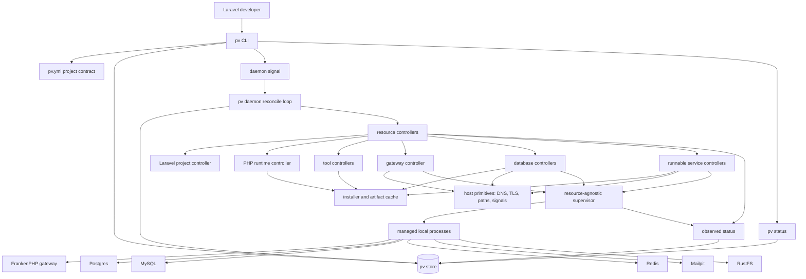

# Epic Architecture: pv Rewrite

## Epic Architecture Overview

The rewrite turns `pv` into a Laravel-first local desired-state control plane.
Commands validate user intent and write desired state. Controllers reconcile one
resource family at a time. The supervisor runs processes without knowing what
Laravel, PHP, Postgres, Redis, Mailpit, RustFS, Caddy, or FrankenPHP mean. The
store is the machine-owned authority for desired state and observed status.

The rewrite stays in Go. The product is mostly OS orchestration: processes,
files, ports, downloads, signals, launchd/systemd integration, DNS, TLS, state,
daemon behavior, and cross-platform builds.

## System Architecture Diagram

## High-Level Features

1. Control-plane foundation and active rewrite workspace.
2. Machine-owned store, filesystem layout, and migration guardrails.
3. PHP runtime and Composer tool model.
4. Daemon and resource-agnostic supervisor.
5. Managed resources: Mailpit, Postgres, MySQL, Redis, RustFS.
6. Laravel project contract generation.
7. Laravel link, env rendering, and setup runner.
8. Gateway `.test` HTTPS routing and `pv open`.
9. Status UX across desired and observed state.
10. Scriptable install planner.
11. Laravel helper commands.
12. Post-MVP backlog and scope guardrails.

## Technical Enablers

- Root rewrite module and legacy prototype isolation.
- Store interface backed first by simple persistence, then SQLite when the
  schema and locking needs are clear.
- Canonical `~/.pv` path helpers.
- Controller interfaces with fake host primitives for testing.
- Supervisor process definitions and readiness probes.
- Installer planner with bounded parallel downloads and dependency ordering.
- Project contract parser and template renderer.
- Env merge module with pv-managed labels and backups.
- Setup runner with pinned PHP runtime on `PATH`.
- Gateway route, DNS, TLS, and browser-open adapters.
- Test harnesses for command, controller, supervisor, and project workflow
  behavior.

## Technology Stack

- Language: Go.
- Persistence: SQLite target for machine-owned mutable state; file-backed
  scaffolding is acceptable only during early tracer work.
- Human project contract: YAML `pv.yml`.
- Remote artifact metadata: generated JSON manifests where useful.
- Process supervision: native Go process management.
- Gateway: FrankenPHP/Caddy as internal gateway infrastructure.
- Tests: Go unit and integration tests, shell E2E where real OS integration is
  required.

## Technical Value

High. This architecture removes prototype-era partial sources of truth and gives
future features a single control-plane model. It improves locality, testability,
scriptability, and long-term maintenance.

## T-Shirt Size Estimate

XL. This is a full product rewrite with multiple epics and should be executed as
several independent vertical slices.
