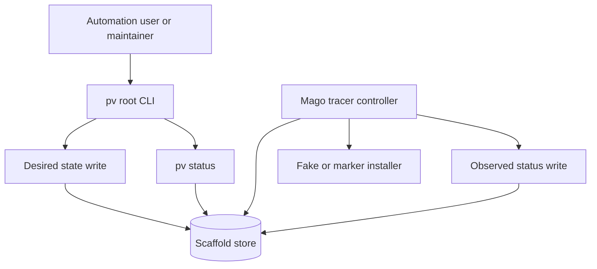

# Epic Architecture: Epic 1 - Rewrite Foundation

## Epic Architecture Overview

Epic 1 creates the active rewrite workspace and proves the first control-plane loop. The only managed resource in this epic is the Mago tracer; it exists to prove command -> desired state -> controller -> observed status without adding Laravel, daemon, supervisor, or service complexity.

## System Architecture Diagram

## High-Level Features

- Prototype Isolation And Root Scaffold.
- First Desired-State Resource Tracer.

## Technical Enablers

- `legacy/prototype` as reference-only module.
- Fresh root Go module and `main.go`.
- Minimal CLI seam: `Run(args, stdout, stderr)`.
- Desired/observed store interface with replaceable scaffold persistence.
- Mago tracer controller and fake installer seam.
- Status output for pending, ready, and failed tracer states.

## Technology Stack

- Go for all active rewrite logic.
- Standard-library command parsing for Epic 1.
- File-backed scaffold store only for the first tracer.
- Go unit tests with fake installers and deterministic clocks.

## Technical Value

High. This epic prevents the rewrite from inheriting prototype structure and proves the core control-plane rule before resource complexity grows.

## T-Shirt Size Estimate

L.
