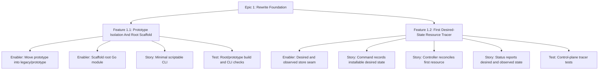

# Project Plan: Epic 1 - Rewrite Foundation

## Epic Overview

Epic 1 establishes the active rewrite workspace and proves the smallest useful
control-plane loop. It should not attempt to build the Laravel product surface
yet. The purpose is to create a clean root module, isolate the prototype, and
ship one vertical tracer that demonstrates the architectural rule:

```text
Commands request state changes.
Controllers reconcile.
Observed status is separate from desired state.
```

## Business Value

- Future rewrite work has a clean root module instead of competing with the
  prototype.
- Agents and contributors know which code is active and which code is
  reference-only.
- The first tracer validates the desired-state model before resource complexity
  increases.

## Success Criteria

- The old implementation is buildable from `legacy/prototype`.
- The root contains a fresh active Go module.
- The root CLI has minimal, scriptable help/version/error behavior.
- Fang is not carried forward by default.
- One installable resource can be requested through desired state.
- A controller reconciles that desired state and records observed status.
- Status can show pending, ready, and failed resource states.
- Root and prototype verification commands are documented.

## Work Item Hierarchy



## Feature Breakdown

| ID | Feature | Priority | Value | Estimate | Blocks |
| --- | --- | --- | --- | --- | --- |
| E1-F1 | Prototype Isolation And Root Scaffold | P0 | High | 5 | E1-F2 |
| E1-F2 | First Desired-State Resource Tracer | P0 | High | 5 | Epic 2 infrastructure and Epic 3 runtime work |

## Story And Enabler Breakdown

| ID | Type | Title | Estimate | Dependencies |
| --- | --- | --- | --- | --- |
| E1-EN1 | Enabler | Move prototype into `legacy/prototype` | 2 | none |
| E1-EN2 | Enabler | Scaffold active root Go module | 2 | E1-EN1 |
| E1-S1 | Story | Provide minimal scriptable CLI | 1 | E1-EN2 |
| E1-T1 | Test | Verify root/prototype build and CLI behavior | 2 | E1-EN1, E1-EN2, E1-S1 |
| E1-EN3 | Enabler | Add desired and observed store seam | 2 | E1-EN2 |
| E1-S2 | Story | Request installable resource desired state | 2 | E1-EN3 |
| E1-S3 | Story | Reconcile first installable resource | 3 | E1-S2 |
| E1-S4 | Story | Report desired and observed status | 2 | E1-S3 |
| E1-T2 | Test | Verify control-plane tracer behavior | 3 | E1-EN3, E1-S2, E1-S3, E1-S4 |

## Priority Matrix

| Priority | Items |
| --- | --- |
| P0 | E1-EN1, E1-EN2, E1-S1, E1-EN3, E1-S2, E1-S3, E1-S4 |
| P1 | E1-T1, E1-T2 |

Test work is P1 only in label priority, but it is required for completion. It
should be created in parallel with the feature work, not after.

## Risks And Mitigations

| Risk | Impact | Mitigation |
| --- | --- | --- |
| Prototype and rewrite code mix | New architecture inherits old package shape | Move prototype as a full module and prohibit imports from root rewrite. |
| CLI scaffold becomes UI-heavy | Rewrite starts with unnecessary dependency drag | Keep direct command parsing until a dependency clearly pays for itself. |
| Store scaffold becomes permanent | JSON/file choices leak into later architecture | Keep store interface small and call out SQLite migration as Epic 2 work. |
| First tracer does too much | Foundation PR becomes hard to review | Use Mago as the only installable resource tracer, with marker installer. |
| Status output overfits formatting | Tests become brittle | Test stable behavior and key lines, not incidental spacing. |

## Definition Of Ready

- Epic 1 issue hierarchy is created or staged from `issues-checklist.md`.
- Legacy #97-#99 and #114 are treated as references only.
- Root/prototype boundaries are understood.
- The implementation PR is scoped to foundation work only.

## Definition Of Done

- Feature 1.1 and Feature 1.2 are complete.
- Test issues E1-T1 and E1-T2 are complete.
- Root verification passes:

```bash
gofmt -w .
go vet ./...
go build ./...
go test ./...
```

- Prototype verification passes if prototype files changed:

```bash
cd legacy/prototype
gofmt -w .
go vet ./...
go build ./...
go test ./...
```

- PR body lists exact verification commands.
- No implementation PR closes legacy #96.
