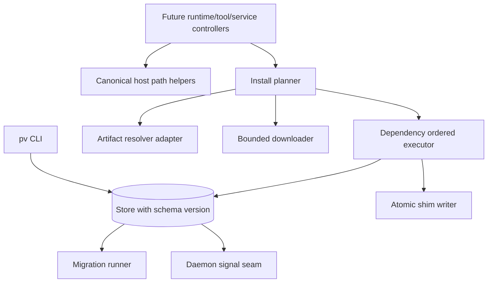

# Epic Architecture: Epic 2 - Store, Host, And Install Infrastructure

## Epic Architecture Overview

Epic 2 hardens the control-plane infrastructure before more resource families are added. It defines canonical host paths, visible store schema/migration seams, the `pv.yml` contract-version ownership decision, and a shared install planner with bounded downloads, dependency ordering, atomic shim exposure, and durable signal ordering.

## System Architecture Diagram

## High-Level Features

- Store And Filesystem Guardrails.
- Scriptable Install Planner.

## Technical Enablers

- Canonical `~/.pv` path helper API.
- Layout validation for binary, data, log, state, cache, and config families.
- Store schema version and applied migration records.
- Forward-only migration runner.
- Explicit contract-version decision: Epic 4 owns parsing and uses top-level `version: 1`.
- Install plan graph with runtime, tool, and service items.
- Bounded downloader and dependency-ordered executor.
- Atomic shim writer.
- Signal seam that runs only after durable persistence succeeds.

## Technology Stack

- Go.
- SQLite target for store evolution; Epic 2 may keep the persistence adapter incremental while exposing schema/migration seams.
- Filesystem operations through host helpers.
- Fake downloader and installer adapters in tests.

## Technical Value

High. This epic prevents path, store, and install behavior from diverging across future resource packages.

## T-Shirt Size Estimate

L.
