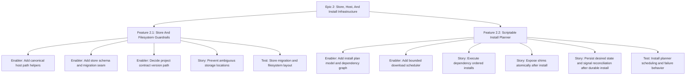

# Project Plan: Epic 2 - Store, Host, And Install Infrastructure

## Epic Overview

Epic 2 builds the infrastructure that keeps later resource work coherent. It
does not add user-facing Laravel behavior. It gives the rewrite canonical path
families, visible state/schema guardrails, and a shared install planner so PHP,
tools, and services do not each invent their own install flow.

## Business Value

- Prevents `~/.pv` from growing organically.
- Keeps machine-owned state separate from human-authored project contracts.
- Makes future migrations explicit instead of mysterious upgrades.
- Gives install/update workflows deterministic planning, bounded downloads, and
  safe shim exposure.
- Reduces duplication before resource packages multiply.

## Success Criteria

- Active rewrite code uses canonical path helpers for bin, runtimes, tools,
  services, data, logs, state, cache, and config.
- Store data has a visible schema version and applied migration seam.
- `pv.yml` contract versioning is represented or explicitly deferred with a
  documented path.
- Layout tests prevent ambiguous binary/data locations.
- Install planner can model runtimes, tools, and services.
- Downloads are bounded.
- Installs are dependency ordered.
- Shim exposure is atomic.
- Failures do not advertise incomplete installs as ready.

## Work Item Hierarchy



## Feature Breakdown

| ID    | Feature                         | Priority | Value | Estimate | Blocks                                             |
| ----- | ------------------------------- | -------- | ----- | -------- | -------------------------------------------------- |
| E2-F1 | Store And Filesystem Guardrails | P0       | High  | 8        | E2-F2, daemon/resource work, Laravel contract work |
| E2-F2 | Scriptable Install Planner      | P1       | High  | 8        | runtime/tool/service install workflows             |

## Story And Enabler Breakdown

| ID     | Type    | Title                                                                 | Estimate | Dependencies                        |
| ------ | ------- | --------------------------------------------------------------------- | -------- | ----------------------------------- |
| E2-EN1 | Enabler | Add canonical host path helpers                                       | 3        | Epic 1 first tracer                 |
| E2-EN2 | Enabler | Add store schema and migration seam                                   | 3        | Epic 1 first tracer                 |
| E2-EN3 | Enabler | Decide project contract version path                                  | 2        | E2-EN2                              |
| E2-S1  | Story   | Prevent ambiguous storage locations                                   | 2        | E2-EN1                              |
| E2-T1  | Test    | Store migration and filesystem layout                                 | 3        | E2-EN1, E2-EN2, E2-S1               |
| E2-EN4 | Enabler | Add install plan model and dependency graph                           | 3        | E2-EN1                              |
| E2-EN5 | Enabler | Add bounded download scheduler                                        | 3        | E2-EN4                              |
| E2-S2  | Story   | Execute dependency ordered installs                                   | 3        | E2-EN4                              |
| E2-S3  | Story   | Expose shims atomically after install                                 | 2        | E2-S2                               |
| E2-S4  | Story   | Persist desired state and signal reconciliation after durable install | 3        | E2-S2, E2-EN2                       |
| E2-T2  | Test    | Install planner scheduling and failure behavior                       | 3        | E2-EN4, E2-EN5, E2-S2, E2-S3, E2-S4 |

## Priority Matrix

| Priority | Items                                      |
| -------- | ------------------------------------------ |
| P0       | E2-EN1, E2-EN2, E2-EN3, E2-S1, E2-T1       |
| P1       | E2-EN4, E2-EN5, E2-S2, E2-S3, E2-S4, E2-T2 |

## Dependencies

Blocked by:

- Epic 1: Rewrite Foundation, especially #123 through #127.

Blocks:

- Epic 3 runtime/resource install behavior.
- Epic 4 Laravel contract and link behavior.
- Epic 5 status behavior where status needs canonical log and state paths.

## Risks And Mitigations

| Risk                                             | Impact                                      | Mitigation                                                                              |
| ------------------------------------------------ | ------------------------------------------- | --------------------------------------------------------------------------------------- |
| File-backed store becomes permanent architecture | Future locking and migrations are weak      | Add schema/migration seams now and keep SQLite as target.                               |
| Path helpers become a junk drawer                | Resource packages bypass layout rules       | Keep helpers role-based and test every canonical path family.                           |
| Contract versioning is ignored                   | Future `pv.yml` upgrades are unclear        | Implement now or explicitly defer with a documented path and issue link.                |
| Install planner becomes too abstract             | Simple installs become hard to reason about | Model concrete runtimes/tools/services and introduce interfaces only for real adapters. |
| Failure leaves partial advertised state          | Users run broken shims or stale status      | Test failure rollback and only persist/expose after durable steps.                      |

## Definition Of Ready

- Epic 1 issues are published and the first tracer store shape is known.
- The canonical filesystem layout from the rewrite architecture is accepted.
- SQLite target is understood even if implementation is incremental.
- Install planner scope is limited to planning infrastructure, not real resource installs.

## Definition Of Done

- Feature 2.1 and Feature 2.2 are complete.
- Test issues E2-T1 and E2-T2 are complete.
- Root verification passes:

```bash
gofmt -w .
go vet ./...
go build ./...
go test ./...
```

- No expensive artifact workflows are run unless explicitly requested.
- New install planner tests use fake resolvers/downloaders/installers.
