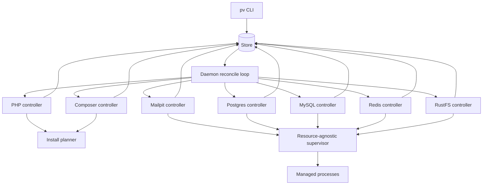

# Epic Architecture: Epic 3 - Runtime, Daemon, And Resources

## Epic Architecture Overview

Epic 3 turns the control-plane infrastructure into managed local resources. Runtime and resource commands write desired state; controllers reconcile PHP, Composer, Mailpit, Postgres, MySQL, Redis, and RustFS; the daemon dispatches controllers; the supervisor remains resource-agnostic and only runs process definitions.

## System Architecture Diagram

## High-Level Features

- PHP Runtime And Composer Tooling.
- Daemon And Supervisor With Mailpit.
- Stateful Database Resources.
- Cache, Mail, And Object Storage Resources.

## Technical Enablers

- PHP runtime controller with managed-path shims.
- Composer tool controller with explicit PHP runtime dependency.
- Daemon reconcile loop and signal handling.
- Supervisor process lifecycle API with restart budget.
- Mailpit as first runnable supervised resource.
- Explicit Postgres and MySQL resource packages.
- Redis cache resource.
- RustFS S3 resource with redacted status.
- Resource env providers for Epic 4 link behavior.

## Technology Stack

- Go.
- Store, host path, and install planner outputs from Epic 2.
- Native process supervision through host adapters.
- Fake installers, processes, ports, and clocks in tests.

## Technical Value

High. This epic provides the infrastructure that makes Laravel projects usable while preserving the desired-state architecture.

## T-Shirt Size Estimate

XL.
