# Project Plan: Epic 3 - Runtime, Daemon, And Resources

## Epic Overview

Epic 3 builds the managed infrastructure layer behind Laravel projects. It
takes the desired-state store, host layout, and install planner from earlier
epics and applies them to runtimes, tools, daemon reconciliation, process
supervision, and concrete resource families.

This epic must keep the architecture honest: commands request desired state,
controllers reconcile resources, and the supervisor only runs processes.

## Business Value

- Laravel projects can rely on pv-managed PHP and Composer instead of system
  installs.
- Long-running resources get consistent process lifecycle, logs, and observed
  status.
- Mailpit gives the daemon and supervisor their first practical runnable
  resource.
- Postgres, MySQL, Redis, and RustFS become explicit declared resources with
  predictable paths and env values.
- Resource-specific behavior stays in resource packages instead of leaking into
  the supervisor.

## Success Criteria

- PHP runtime desired state can be requested, reconciled, and reported.
- Composer is modeled as a tool that depends on a PHP runtime.
- CLI shims are exposed atomically and are runtime-aware.
- Composer reports a blocked state when the required PHP runtime is missing.
- The daemon reconcile loop can react to durable desired-state changes.
- The supervisor manages process lifecycle without resource-specific behavior.
- Mailpit runs as the first supervised resource with PID, port, log, and failure
  status.
- Postgres and MySQL are implemented as explicit stateful database resources.
- Redis is implemented as a runnable stateful cache resource.
- RustFS is implemented as an S3 resource with safe credential and route status.
- Env values are exposed by resource controllers without hidden `.env`
  inference.

## Work Item Hierarchy

```mermaid
graph TD
  A[Epic 3: Runtime, Daemon, And Resources] --> B[Feature 3.1: PHP Runtime And Composer Tooling]
  A --> C[Feature 3.2: Daemon And Supervisor With Mailpit]
  A --> D[Feature 3.3: Stateful Database Resources]
  A --> E[Feature 3.4: Cache, Mail, And Object Storage Resources]

  B --> B1[Enabler: Add PHP runtime desired-state controller]
  B --> B2[Story: Request PHP runtime install desired state]
  B --> B3[Enabler: Add Composer tool dependency on PHP runtime]
  B --> B4[Story: Expose runtime-aware CLI shims atomically]
  B --> B5[Test: PHP and Composer runtime dependency behavior]

  C --> C1[Enabler: Add daemon reconcile loop]
  C --> C2[Enabler: Add resource-agnostic supervisor]
  C --> C3[Story: Manage Mailpit as first runnable resource]
  C --> C4[Story: Record runnable resource observed status]
  C --> C5[Test: Daemon and supervisor process lifecycle]

  D --> D1[Story: Manage Postgres version-line resource]
  D --> D2[Story: Expose Postgres env values and explicit database commands]
  D --> D3[Story: Manage MySQL version-line resource]
  D --> D4[Story: Preserve MySQL-specific initialization and process semantics]
  D --> D5[Test: Stateful database resource behavior]

  E --> E1[Story: Manage Redis runnable stateful resource]
  E --> E2[Story: Manage RustFS S3 resource]
  E --> E3[Story: Expose cache, mail, and object storage env values]
  E --> E4[Test: Redis, Mailpit, and RustFS resource behavior]
```



## Feature Breakdown

| ID    | Feature                                      | Priority | Value | Estimate | Blocks                              |
| ----- | -------------------------------------------- | -------- | ----- | -------- | ----------------------------------- |
| E3-F1 | PHP Runtime And Composer Tooling             | P0       | High  | 5        | Epic 4 init, link, gateway, helpers |
| E3-F2 | Daemon And Supervisor With Mailpit           | P0       | High  | 8        | database/resources, status UX       |
| E3-F3 | Stateful Database Resources                  | P0       | High  | 13       | Laravel env, setup, db helper       |
| E3-F4 | Cache, Mail, And Object Storage Resources    | P1       | High  | 13       | Laravel env, mail, s3 helpers       |

## Story And Enabler Breakdown

| ID     | Type    | Title                                                                | Estimate | Dependencies                  |
| ------ | ------- | -------------------------------------------------------------------- | -------- | ----------------------------- |
| E3-EN1 | Enabler | Add PHP runtime desired-state controller                             | 3        | Epic 2 path/store/install     |
| E3-S1  | Story   | Request PHP runtime install desired state                            | 2        | E3-EN1                        |
| E3-EN2 | Enabler | Add Composer tool dependency on PHP runtime                          | 2        | E3-EN1                        |
| E3-S2  | Story   | Expose runtime-aware CLI shims atomically                            | 2        | E3-S1, E3-EN2                 |
| E3-T1  | Test    | PHP and Composer runtime dependency behavior                         | 3        | E3-EN1, E3-S1, E3-EN2, E3-S2  |
| E3-EN3 | Enabler | Add daemon reconcile loop                                            | 3        | Epic 2 store/signaling seam   |
| E3-EN4 | Enabler | Add resource-agnostic supervisor                                     | 5        | E3-EN3                        |
| E3-S3  | Story   | Manage Mailpit as first runnable resource                            | 3        | E3-EN4                        |
| E3-S4  | Story   | Record runnable resource observed status                             | 3        | E3-EN3, E3-EN4, E3-S3         |
| E3-T2  | Test    | Daemon and supervisor process lifecycle                              | 5        | E3-EN3, E3-EN4, E3-S3, E3-S4  |
| E3-S5  | Story   | Manage Postgres version-line resource                                | 5        | E3-F2, Epic 2 install planner |
| E3-S6  | Story   | Expose Postgres env values and explicit database commands            | 3        | E3-S5                         |
| E3-S7  | Story   | Manage MySQL version-line resource                                   | 5        | E3-F2, E3-S5                  |
| E3-S8  | Story   | Preserve MySQL-specific initialization and process semantics          | 3        | E3-S7                         |
| E3-T3  | Test    | Stateful database resource behavior                                  | 5        | E3-S5, E3-S6, E3-S7, E3-S8    |
| E3-S9  | Story   | Manage Redis runnable stateful resource                              | 3        | E3-F2                         |
| E3-S10 | Story   | Manage RustFS S3 resource                                            | 5        | E3-F2                         |
| E3-S11 | Story   | Expose cache, mail, and object storage env values                    | 3        | E3-S3, E3-S9, E3-S10          |
| E3-T4  | Test    | Redis, Mailpit, and RustFS resource behavior                         | 5        | E3-S3, E3-S9, E3-S10, E3-S11  |

## Priority Matrix

| Priority | Items                                                                 |
| -------- | --------------------------------------------------------------------- |
| P0       | E3-EN1, E3-S1, E3-EN2, E3-S2, E3-T1, E3-EN3, E3-EN4, E3-S3, E3-S4, E3-T2, E3-S5, E3-S6, E3-S7, E3-S8, E3-T3 |
| P1       | E3-S9, E3-S10, E3-S11, E3-T4                                          |

## Dependencies

Blocked by:

- Epic 1: Rewrite Foundation.
- Epic 2: Store, Host, And Install Infrastructure.

Blocks:

- Epic 4 project contract, link, env, setup, gateway, and helper commands.
- Epic 5 aggregate status UX and release QA.

## Risks And Mitigations

| Risk | Impact | Mitigation |
| --- | --- | --- |
| Supervisor learns resource behavior | Process lifecycle becomes coupled to specific services | Keep process definitions plain and assert supervisor APIs stay resource-agnostic. |
| PHP and Composer fall back to system state | Users get nondeterministic behavior | Test runtime resolution and shims against temp roots and fake binaries. |
| Database resources are over-generalized | MySQL and Postgres edge cases disappear behind weak abstraction | Implement Postgres first, extract only proven shared mechanics, then add MySQL explicitly. |
| Daemon tests become flaky | Lifecycle regressions are hard to verify | Use fake processes and clocks for unit tests; reserve real process tests for narrow integration checks. |
| Secrets leak through status or logs | Local credentials become visible unnecessarily | Redact RustFS credentials and assert secret-like values are not printed. |
| Resource installs run expensive workflows in tests | CI becomes slow and brittle | Use fake artifact resolvers and never download artifacts unless explicitly requested. |

## Definition Of Ready

- Epic 2 install planner and canonical path decisions are published.
- Store APIs expose desired and observed state for controllers.
- Host/process adapters are available or planned for daemon and supervisor work.
- Resource scope is limited to PHP, Composer, Mailpit, Postgres, MySQL, Redis,
  and RustFS.

## Definition Of Done

- Features 3.1 through 3.4 are complete.
- Test issues E3-T1 through E3-T4 are complete.
- Resource controllers expose explicit env values without hidden `.env`
  inference.
- Supervisor remains resource-agnostic.
- Root verification passes:

```bash
gofmt -w .
go vet ./...
go build ./...
go test ./...
```

- No expensive artifact workflows were run unless explicitly requested.
