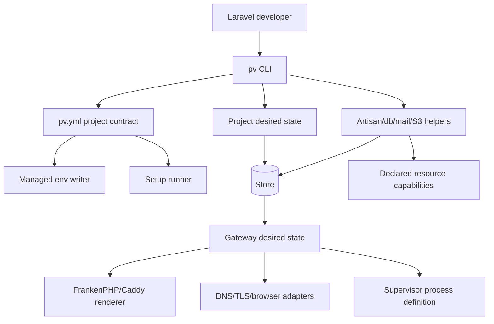

# Epic Architecture: Epic 4 - Laravel Project Experience

## Epic Architecture Overview

Epic 4 turns managed runtimes and resources into the Laravel-first product workflow. `pv init` generates a reviewable `pv.yml`; `pv link` validates that contract, records durable project desired state, writes only declared env values, runs declared setup commands, and signals reconciliation; gateway work serves linked apps at HTTPS `.test`; helper commands route through current project state and declared resources.

## System Architecture Diagram

## High-Level Features

- Project Contract And Init.
- Link, Env, And Setup.
- Gateway And pv open.
- Laravel Helper Commands.

## Technical Enablers

- Versioned `pv.yml` schema with top-level `version: 1`.
- Laravel detection and deterministic contract generator.
- Project desired-state/registry model.
- Managed env merge writer with backups and pv-managed labels.
- Setup runner for ordered shell command strings with pinned PHP on PATH.
- Gateway desired/observed state and deterministic route rendering.
- DNS, TLS, and browser adapters.
- Current-project resolution and helper command routing.

## Technology Stack

- Go.
- YAML `pv.yml` project contract.
- FrankenPHP/Caddy as gateway infrastructure.
- Host adapters for DNS, TLS, browser, files, and processes.
- Go tests with generated Laravel fixtures and fake adapters.

## Technical Value

High. This epic delivers the Laravel-first user workflow while preserving explicit project configuration and scriptable command behavior.

## T-Shirt Size Estimate

XL.
