# Project Plan: Epic 4 - Laravel Project Experience

## Epic Overview

Epic 4 turns the managed runtime and resource layer into the user-facing Laravel
workflow. A Laravel developer should be able to generate a reviewable contract,
link the project, write only declared env values, run setup through managed PHP,
serve the app at HTTPS `.test`, open it, and use helper commands that route to
declared resources.

This epic is where the product becomes Laravel-first instead of a generic
service manager.

## Business Value

- Gives Laravel users a coherent daily workflow instead of isolated resource
  commands.
- Makes project configuration explicit through `pv.yml`.
- Prevents `.env` clobbering and hidden service inference.
- Lets setup commands run reproducibly through pinned managed PHP.
- Provides the Herd replacement surface: HTTPS `.test`, `pv open`, Artisan,
  database, mail, and S3 helpers.

## Success Criteria

- `pv init` detects Laravel projects and generates a reviewable `pv.yml`.
- Contract parsing and validation reject ambiguous or unsupported declarations.
- Existing contracts are not overwritten unless forced.
- `pv link` records durable desired project state from `pv.yml`.
- Env writes are labeled, declared-only, and reversible through backups.
- Setup commands run in project directory with managed PHP and fail fast.
- Gateway route rendering is deterministic.
- Linked apps serve at HTTPS `.test` hosts with alias support.
- `pv open` opens the linked app through a browser adapter.
- Helper commands route through the current project and declared resources.

## Work Item Hierarchy

```mermaid
graph TD
  A[Epic 4: Laravel Project Experience] --> B[Feature 4.1: Project Contract And Init]
  A --> C[Feature 4.2: Link, Env, And Setup]
  A --> D[Feature 4.3: Gateway And pv open]
  A --> E[Feature 4.4: Laravel Helper Commands]

  B --> B1[Enabler: Add project contract schema and parser]
  B --> B2[Enabler: Add Laravel detection and contract generator]
  B --> B3[Story: Generate reviewable pv.yml with pv init]
  B --> B4[Story: Refuse contract overwrite unless forced]
  B --> B5[Test: Project contract and init behavior]

  C --> C1[Enabler: Add project registry desired-state model]
  C --> C2[Enabler: Add managed env merge writer]
  C --> C3[Enabler: Add setup runner with pinned runtime]
  C --> C4[Story: Link Laravel project from pv.yml]
  C --> C5[Story: Fail fast on missing services or setup errors]
  C --> C6[Test: Link env and setup behavior]

  D --> D1[Enabler: Add gateway desired and observed state]
  D --> D2[Enabler: Add deterministic FrankenPHP/Caddy route rendering]
  D --> D3[Enabler: Add TLS and DNS host adapters]
  D --> D4[Story: Serve linked Laravel app at HTTPS test host]
  D --> D5[Story: Open linked Laravel app with pv open]
  D --> D6[Test: Gateway and pv open behavior]

  E --> E1[Story: Run Artisan through pinned PHP runtime]
  E --> E2[Story: Route database helper to declared database resource]
  E --> E3[Story: Route mail helper to declared Mailpit resource]
  E --> E4[Story: Route S3 helper to declared RustFS resource]
  E --> E5[Test: Laravel helper command routing]
```



## Feature Breakdown

| ID    | Feature                        | Priority | Value | Estimate | Blocks                  |
| ----- | ------------------------------ | -------- | ----- | -------- | ----------------------- |
| E4-F1 | Project Contract And Init      | P0       | High  | 8        | link, env, setup        |
| E4-F2 | Link, Env, And Setup           | P0       | High  | 13       | gateway, helper commands |
| E4-F3 | Gateway And pv open            | P0       | High  | 13       | status and release QA   |
| E4-F4 | Laravel Helper Commands        | P1       | High  | 8        | daily Laravel workflow  |

## Story And Enabler Breakdown

| ID      | Type    | Title                                                     | Estimate | Dependencies                  |
| ------- | ------- | --------------------------------------------------------- | -------- | ----------------------------- |
| E4-EN1  | Enabler | Add project contract schema and parser                    | 3        | Epic 2 contract version path  |
| E4-EN2  | Enabler | Add Laravel detection and contract generator              | 3        | E4-EN1                        |
| E4-S1   | Story   | Generate reviewable pv.yml with pv init                   | 3        | E4-EN1, E4-EN2                |
| E4-S2   | Story   | Refuse contract overwrite unless forced                   | 2        | E4-S1                         |
| E4-T1   | Test    | Project contract and init behavior                        | 3        | E4-EN1, E4-EN2, E4-S1, E4-S2  |
| E4-EN3  | Enabler | Add project registry desired-state model                  | 3        | E4-F1, Epic 2 store           |
| E4-EN4  | Enabler | Add managed env merge writer                              | 5        | E4-EN3                        |
| E4-EN5  | Enabler | Add setup runner with pinned runtime                      | 5        | Epic 3 PHP runtime            |
| E4-S3   | Story   | Link Laravel project from pv.yml                          | 5        | E4-EN3, E4-EN4                |
| E4-S4   | Story   | Fail fast on missing services or setup errors             | 3        | E4-EN5, Epic 3 resources      |
| E4-T2   | Test    | Link env and setup behavior                               | 5        | E4-EN3, E4-EN4, E4-EN5, E4-S3 |
| E4-EN6  | Enabler | Add gateway desired and observed state                    | 3        | E4-S3, Epic 3 supervisor      |
| E4-EN7  | Enabler | Add deterministic FrankenPHP/Caddy route rendering        | 5        | E4-EN6                        |
| E4-EN8  | Enabler | Add TLS and DNS host adapters                             | 5        | Epic 2 host primitives        |
| E4-S5   | Story   | Serve linked Laravel app at HTTPS test host               | 5        | E4-EN6, E4-EN7, E4-EN8        |
| E4-S6   | Story   | Open linked Laravel app with pv open                      | 2        | E4-S5                         |
| E4-T3   | Test    | Gateway and pv open behavior                              | 5        | E4-EN6, E4-EN7, E4-EN8, E4-S5 |
| E4-S7   | Story   | Run Artisan through pinned PHP runtime                    | 3        | E4-S3, Epic 3 PHP runtime     |
| E4-S8   | Story   | Route database helper to declared database resource       | 3        | E4-S3, Epic 3 databases       |
| E4-S9   | Story   | Route mail helper to declared Mailpit resource            | 2        | E4-S3, Epic 3 Mailpit         |
| E4-S10  | Story   | Route S3 helper to declared RustFS resource               | 2        | E4-S3, Epic 3 RustFS          |
| E4-T4   | Test    | Laravel helper command routing                            | 3        | E4-S7, E4-S8, E4-S9, E4-S10   |

## Priority Matrix

| Priority | Items |
| -------- | ----- |
| P0 | E4-EN1, E4-EN2, E4-S1, E4-S2, E4-T1, E4-EN3, E4-EN4, E4-EN5, E4-S3, E4-S4, E4-T2, E4-EN6, E4-EN7, E4-EN8, E4-S5, E4-S6, E4-T3 |
| P1 | E4-S7, E4-S8, E4-S9, E4-S10, E4-T4 |

## Dependencies

Blocked by:

- Epic 2 store, host, and contract versioning decisions.
- Epic 3 PHP runtime, resources, daemon, and supervisor.

Blocks:

- Epic 5 aggregate status, release QA, and MVP acceptance.

## Risks And Mitigations

| Risk | Impact | Mitigation |
| --- | --- | --- |
| `pv link` infers from `.env` | Hidden service setup returns | Tests must prove declared-only env behavior. |
| Env writer clobbers user values | User projects lose local configuration | Label managed blocks, back up files, and test removal/updates. |
| Setup runner uses system PHP | Results differ across machines | Pin PATH and executable resolution to managed runtime. |
| Gateway tests mutate host OS | Tests become unsafe and flaky | Keep DNS, TLS, and browser behavior behind adapters. |
| Helpers bypass project contract | Commands hit wrong resources | Resolve current project first and require declared resources. |

## Definition Of Ready

- Epic 3 runtime and resource issue hierarchy is published.
- `pv.yml` contract versioning path is decided.
- Resource controllers expose explicit env values.
- Gateway work can use host adapters for DNS, TLS, and browser open behavior.

## Definition Of Done

- Features 4.1 through 4.4 are complete.
- Test issues E4-T1 through E4-T4 are complete.
- `pv link` never infers services from `.env`.
- Helper commands resolve current project and declared resources.
- Root verification passes:

```bash
gofmt -w .
go vet ./...
go build ./...
go test ./...
```

- Any OS-level gateway behavior is adapter-tested or documented as manual QA.
