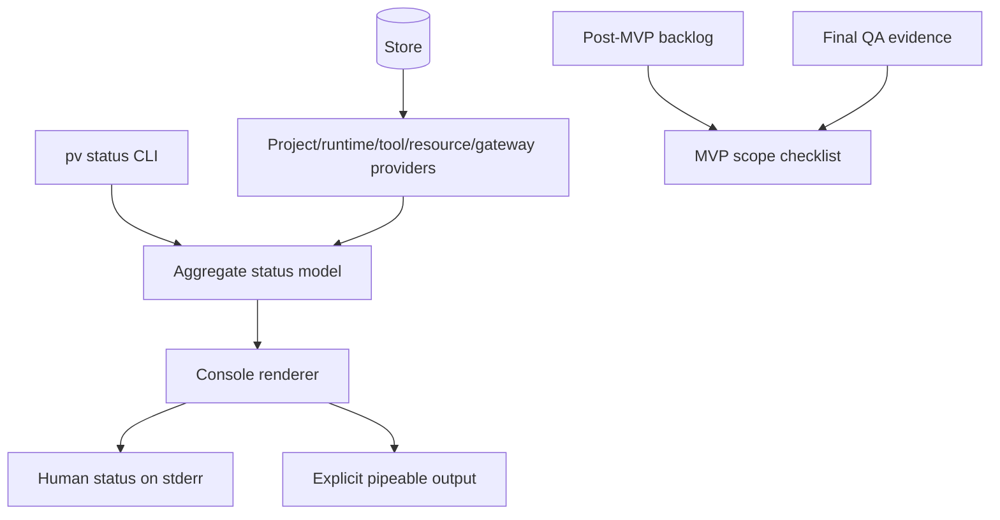

# Epic Architecture: Epic 5 - Status, Quality, And Scope Control

## Epic Architecture Overview

Epic 5 makes the rewrite understandable and releasable. Status providers expose desired and observed facts without rendering; aggregate status normalizes those facts; console rendering stays stable and scriptable; scope control documents deferred capabilities and prevents silent MVP expansion.

## System Architecture Diagram

## High-Level Features

- Desired And Observed Status UX.
- Post-MVP Backlog.

## Technical Enablers

- Aggregate status model.
- Status provider shape for projects, runtimes, tools, resources, gateway, daemon, and supervisor.
- Normalized status states.
- Failure metadata: log path, last error, last reconcile time, next action.
- Stable human rendering and explicit machine output if introduced.
- Post-MVP backlog and MVP scope checklist.
- Final QA evidence mapping.

## Technology Stack

- Go.
- Store and status providers from Epics 1-4.
- Console rendering tests with deterministic clocks and secret sentinels.
- Markdown planning docs for backlog and scope checklist.

## Technical Value

High. This epic turns raw control-plane state into actionable user feedback and preserves MVP boundaries.

## T-Shirt Size Estimate

M.
