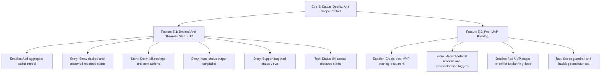

# Project Plan: Epic 5 - Status, Quality, And Scope Control

## Epic Overview

Epic 5 turns the MVP into something maintainable and releasable. It adds
aggregate desired/observed status, failures, logs, next actions, scriptable
output behavior, final QA gates, and a post-MVP backlog that keeps omitted work
out of the MVP.

## Business Value

- Users can understand what pv wants, what actually happened, and how to fix
  failures.
- Maintainers get release-quality gates for the rewrite.
- MVP scope stays focused on the Laravel-first product path.
- Deferred features remain visible without leaking into active execution.

## Success Criteria

- `pv status` reports desired state, observed state, failures, logs, and next
  actions.
- Status supports healthy, stopped, missing install, blocked, crashed, failed,
  and partially reconciled states where applicable.
- Human status remains stable and scriptable.
- Targeted status views are available where they reduce noise.
- Post-MVP backlog records omitted capabilities, deferral reasons, and
  reconsideration triggers.
- MVP scope checklist is part of planning/review flow.
- Final QA confirms all epic test strategies and issue hierarchies are covered.

## Work Item Hierarchy



## Feature Breakdown

| ID    | Feature                         | Priority | Value | Estimate | Blocks            |
| ----- | ------------------------------- | -------- | ----- | -------- | ----------------- |
| E5-F1 | Desired And Observed Status UX  | P0       | High  | 8        | release readiness |
| E5-F2 | Post-MVP Backlog                | P1       | High  | 3        | scope control     |

## Story And Enabler Breakdown

| ID     | Type    | Title                                                | Estimate | Dependencies                 |
| ------ | ------- | ---------------------------------------------------- | -------- | ---------------------------- |
| E5-EN1 | Enabler | Add aggregate status model                           | 3        | Epics 1-4 status providers   |
| E5-S1  | Story   | Show desired and observed resource status            | 3        | E5-EN1                       |
| E5-S2  | Story   | Show failures logs and next actions                  | 3        | E5-EN1                       |
| E5-S3  | Story   | Keep status output scriptable                        | 2        | E5-S1, E5-S2                 |
| E5-S4  | Story   | Support targeted status views                        | 2        | E5-S1                        |
| E5-T1  | Test    | Status UX across resource states                     | 5        | E5-EN1, E5-S1, E5-S2, E5-S3 |
| E5-EN2 | Enabler | Create post-MVP backlog document                     | 1        | PRD out-of-scope section     |
| E5-S5  | Story   | Record deferral reasons and reconsideration triggers | 1        | E5-EN2                       |
| E5-EN3 | Enabler | Add MVP scope checklist to planning docs             | 1        | E5-EN2                       |
| E5-T2  | Test    | Scope guardrail and backlog completeness             | 2        | E5-EN2, E5-S5, E5-EN3        |

## Priority Matrix

| Priority | Items |
| -------- | ----- |
| P0 | E5-EN1, E5-S1, E5-S2, E5-S3, E5-S4, E5-T1 |
| P1 | E5-EN2, E5-S5, E5-EN3, E5-T2 |

## Dependencies

Blocked by:

- Epics 1-4 status providers, resource controllers, gateway behavior, and
  project workflow.

Blocks:

- MVP release readiness.

## Risks And Mitigations

| Risk | Impact | Mitigation |
| --- | --- | --- |
| Status becomes decorative | Users still cannot debug failures | Include desired, observed, logs, failures, and next actions. |
| Output is too human-only | Scripting becomes brittle | Keep stable formats and reserve stdout for pipeable output. |
| Backlog becomes a wishlist | MVP expands silently | Require deferral reason and reconsideration trigger. |
| QA relies on proxy signals | Release misses acceptance gaps | Map each epic acceptance criterion to tests or manual QA. |

## Definition Of Ready

- Epics 1-4 issue hierarchies and test strategies are published.
- Resource and project controllers expose desired/observed status data.
- Out-of-scope capabilities from the PRD are known.

## Definition Of Done

- Features 5.1 and 5.2 are complete.
- Test issues E5-T1 and E5-T2 are complete.
- Status output covers core resource/project states.
- Post-MVP backlog and MVP scope checklist exist.
- Root verification passes:

```bash
gofmt -w .
go vet ./...
go build ./...
go test ./...
```

- Final QA maps every MVP acceptance criterion to evidence.
