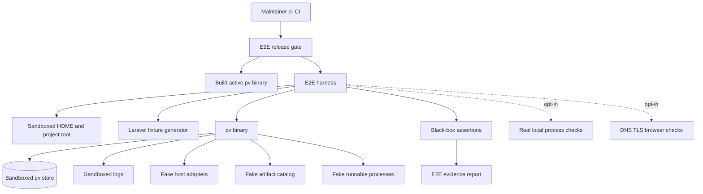

# Epic Architecture: Epic 6 - E2E Rewrite Validation

## Epic Architecture Overview

Epic 6 adds an end-to-end validation layer around the rewritten pv. The harness
builds the active rewrite binary, runs commands in a sandboxed environment, uses
deterministic fixtures and ports, captures logs and status, and separates default
hermetic checks from opt-in real process and privileged host checks.

## System Architecture Diagram

## High-Level Features

- E2E Harness And Fixtures.
- Laravel Project Lifecycle E2E.
- Resource Failure And Recovery E2E.
- CI And Release Gates.

## Technical Enablers

- E2E runner package or command that builds the active rewrite binary.
- Sandbox environment builder for `HOME`, pv state root, project root, logs,
  cache, config, ports, and cleanup.
- Minimal Laravel fixture generator with deterministic files.
- Fake artifact catalog and fake process binaries for default hermetic E2E.
- Output assertion helpers for stdout, stderr, exit code, status, logs, and file
  contents.
- Tiered E2E tags or flags: hermetic, local-process, privileged-host.
- CI/release gate documentation for required and opt-in tiers.

## Technology Stack

- Go test harness and Go helper packages.
- Compiled active rewrite `pv` binary.
- Temporary directories via test framework.
- Fake binaries or local test helper processes for daemon/supervisor checks.
- Shell only where invoking the built CLI is clearer than Go APIs.

## Technical Value

High. This epic validates the integrated rewrite behavior and prevents release
claims based only on package-level tests.

## T-Shirt Size Estimate

L.
