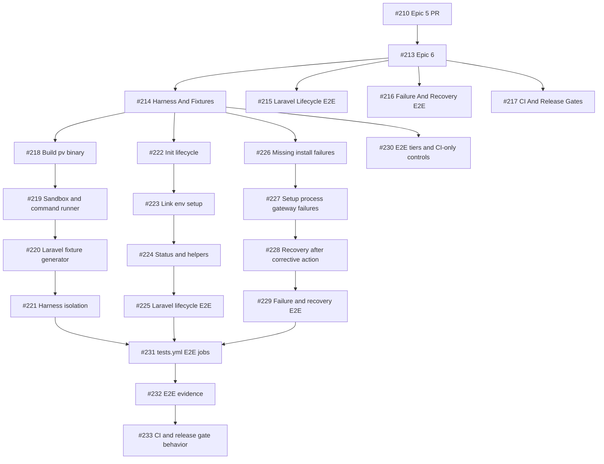

# Issue Tracker: Epic 6 - E2E Rewrite Validation

Milestone: `pv rewrite MVP`

Planning PR: #212

Base PR dependency: #210

## Hierarchy

| ID | Issue | Type | Title | Parent | Labels |
| --- | --- | --- | --- | --- | --- |
| E6 | #213 | Epic | E2E Rewrite Validation | #210 | `epic`, `priority-critical`, `value-high`, `quality`, `e2e` |
| E6-F1 | #214 | Feature | E2E Harness And Fixtures | #213 | `feature`, `priority-critical`, `value-high`, `quality`, `e2e` |
| E6-F2 | #215 | Feature | Laravel Project Lifecycle E2E | #213 | `feature`, `priority-critical`, `value-high`, `quality`, `e2e`, `laravel` |
| E6-F3 | #216 | Feature | Resource Failure And Recovery E2E | #213 | `feature`, `priority-critical`, `value-high`, `quality`, `e2e` |
| E6-F4 | #217 | Feature | CI And Release Gates | #213 | `feature`, `priority-high`, `value-high`, `quality`, `e2e` |
| E6-EN1 | #218 | Enabler | Build pv binary for E2E | #214 | `enabler`, `priority-critical`, `quality`, `e2e`, `ready-for-agent` |
| E6-EN2 | #219 | Enabler | Add sandbox and command runner | #214 | `enabler`, `priority-critical`, `quality`, `e2e`, `ready-for-agent` |
| E6-EN3 | #220 | Enabler | Add Laravel fixture generator | #214 | `enabler`, `priority-critical`, `quality`, `e2e`, `laravel`, `ready-for-agent` |
| E6-T1 | #221 | Test | Harness Isolation And Cleanup | #214 | `test`, `priority-critical`, `quality`, `e2e`, `ready-for-agent` |
| E6-S1 | #222 | User Story | Validate pv init lifecycle | #215 | `user-story`, `priority-critical`, `quality`, `e2e`, `laravel`, `ready-for-agent` |
| E6-S2 | #223 | User Story | Validate pv link env setup lifecycle | #215 | `user-story`, `priority-critical`, `quality`, `e2e`, `laravel`, `ready-for-agent` |
| E6-S3 | #224 | User Story | Validate status and helper workflows | #215 | `user-story`, `priority-critical`, `quality`, `e2e`, `laravel`, `ready-for-agent` |
| E6-T2 | #225 | Test | Laravel Lifecycle E2E | #215 | `test`, `priority-critical`, `quality`, `e2e`, `laravel`, `ready-for-agent` |
| E6-S4 | #226 | User Story | Validate missing install and blocked dependency failures | #216 | `user-story`, `priority-critical`, `quality`, `e2e`, `ready-for-agent` |
| E6-S5 | #227 | User Story | Validate setup process and gateway failures | #216 | `user-story`, `priority-critical`, `quality`, `e2e`, `ready-for-agent` |
| E6-S6 | #228 | User Story | Validate recovery after corrective action | #216 | `user-story`, `priority-critical`, `quality`, `e2e`, `ready-for-agent` |
| E6-T3 | #229 | Test | Failure And Recovery E2E | #216 | `test`, `priority-critical`, `quality`, `e2e`, `ready-for-agent` |
| E6-EN4 | #230 | Enabler | Define E2E tiers and CI-only controls | #217 | `enabler`, `priority-high`, `quality`, `e2e`, `ready-for-agent` |
| E6-EN5 | #231 | Enabler | Extend tests workflow with E2E jobs | #217 | `enabler`, `priority-high`, `quality`, `e2e`, `ready-for-agent` |
| E6-S7 | #232 | User Story | Record E2E evidence for release | #217 | `user-story`, `priority-high`, `quality`, `e2e`, `ready-for-agent` |
| E6-T4 | #233 | Test | CI And Release Gate Behavior | #217 | `test`, `priority-high`, `quality`, `e2e`, `ready-for-agent` |

## Dependency Chain

## Publishing Notes

- All issues are on milestone `pv rewrite MVP`.
- Leaf issues #218-#233 are labeled `ready-for-agent`.
- Container issues #213-#217 intentionally do not have `ready-for-agent`.
- Issue bodies link back to planning PR #212.
- PR #212 links the full issue hierarchy but does not close it; implementation work will close leaf issues later.
