# Project Plan: Epic 6 - E2E Rewrite Validation

## Epic Overview

Epic 6 adds black-box end-to-end validation for the new rewrite. It runs after
Epic 5 in the stacked diff plan and proves the full Laravel-first control-plane
workflow works through the compiled `pv` binary.

## Business Value

- Maintainers get release evidence for the integrated rewrite.
- Agents cannot claim feature completion based only on unit or integration tests.
- User-visible behavior such as stdout/stderr, exit codes, files, logs, status,
  and recovery flows is validated end to end.
- Risky host mutation remains opt-in instead of surprising developers or CI.

## Success Criteria

- Required Tier 0 E2E suite is hermetic and repeatable.
- E2E tests build and invoke the active rewrite binary.
- `pv init`, `pv link`, status, gateway, helpers, failure, and recovery paths are
  covered by black-box scenarios.
- Default E2E does not mutate real host state or download artifacts.
- CI/release gate documentation makes required and opt-in E2E tiers explicit.

## Work Item Hierarchy

```mermaid
graph TD
  A[Epic 6: E2E Rewrite Validation] --> B[Feature 6.1: E2E Harness And Fixtures]
  A --> C[Feature 6.2: Laravel Project Lifecycle E2E]
  A --> D[Feature 6.3: Resource Failure And Recovery E2E]
  A --> E[Feature 6.4: CI And Release Gates]

  B --> B1[Enabler: Build pv binary for E2E]
  B --> B2[Enabler: Add sandbox and command runner]
  B --> B3[Enabler: Add Laravel fixture generator]
  B --> B4[Test: Harness isolation and cleanup]

  C --> C1[Story: Validate pv init lifecycle]
  C --> C2[Story: Validate pv link env setup lifecycle]
  C --> C3[Story: Validate status and helper workflows]
  C --> C4[Test: Laravel lifecycle E2E]

  D --> D1[Story: Validate missing install and blocked dependency failures]
  D --> D2[Story: Validate setup process and gateway failures]
  D --> D3[Story: Validate recovery after corrective action]
  D --> D4[Test: Failure and recovery E2E]

  E --> E1[Enabler: Define E2E tiers and opt-in controls]
  E --> E2[Enabler: Add release gate command]
  E --> E3[Story: Record E2E evidence for release]
  E --> E4[Test: CI and release gate behavior]
```



## Feature Breakdown

| ID | Feature | Priority | Value | Estimate | Blocks |
| --- | --- | --- | --- | --- | --- |
| E6-F1 | E2E Harness And Fixtures | P0 | High | 8 | all Epic 6 scenarios |
| E6-F2 | Laravel Project Lifecycle E2E | P0 | High | 8 | release readiness |
| E6-F3 | Resource Failure And Recovery E2E | P0 | High | 8 | release readiness |
| E6-F4 | CI And Release Gates | P1 | High | 5 | final MVP gate |

## Story And Enabler Breakdown

| ID | Type | Title | Estimate | Dependencies |
| --- | --- | --- | --- | --- |
| E6-EN1 | Enabler | Build pv binary for E2E | 2 | Epic 5 stack branch |
| E6-EN2 | Enabler | Add sandbox and command runner | 3 | E6-EN1 |
| E6-EN3 | Enabler | Add Laravel fixture generator | 3 | E6-EN2 |
| E6-T1 | Test | Harness isolation and cleanup | 3 | E6-EN1, E6-EN2, E6-EN3 |
| E6-S1 | Story | Validate pv init lifecycle | 3 | E6-F1 |
| E6-S2 | Story | Validate pv link env setup lifecycle | 5 | E6-S1, Epics 3-5 |
| E6-S3 | Story | Validate status and helper workflows | 5 | E6-S2 |
| E6-T2 | Test | Laravel lifecycle E2E | 5 | E6-S1, E6-S2, E6-S3 |
| E6-S4 | Story | Validate missing install and blocked dependency failures | 3 | E6-F1, Epic 5 status |
| E6-S5 | Story | Validate setup process and gateway failures | 5 | E6-S4, Epic 4 gateway |
| E6-S6 | Story | Validate recovery after corrective action | 5 | E6-S4, E6-S5 |
| E6-T3 | Test | Failure and recovery E2E | 5 | E6-S4, E6-S5, E6-S6 |
| E6-EN4 | Enabler | Define E2E tiers and opt-in controls | 2 | E6-F1 |
| E6-EN5 | Enabler | Add release gate command | 3 | E6-T1, E6-T2, E6-T3 |
| E6-S7 | Story | Record E2E evidence for release | 2 | E6-EN5 |
| E6-T4 | Test | CI and release gate behavior | 3 | E6-EN4, E6-EN5, E6-S7 |

## Priority Matrix

| Priority | Items |
| --- | --- |
| P0 | E6-EN1, E6-EN2, E6-EN3, E6-T1, E6-S1, E6-S2, E6-S3, E6-T2, E6-S4, E6-S5, E6-S6, E6-T3 |
| P1 | E6-EN4, E6-EN5, E6-S7, E6-T4 |

## Dependencies

Blocked by:

- Epic 5: Status, Quality, And Scope Control.
- Completed stacked branches for Epics 1-5.

Blocks:

- MVP release readiness.
- Any claim that the rewrite stack is ready to land as a complete product slice.

## Risks And Mitigations

| Risk | Impact | Mitigation |
| --- | --- | --- |
| E2E mutates developer machine | Tests become unsafe | Tier 0 is hermetic; Tier 2 is opt-in and prints host actions first. |
| E2E becomes slow and flaky | Release gate gets ignored | Keep Tier 0 focused, deterministic, and fake external dependencies. |
| Harness tests internals | E2E misses user-visible failures | Invoke compiled binary and assert public behavior only. |
| Artifact downloads sneak into default runs | CI and local runs become expensive | Default E2E uses fake artifact catalog and fake binaries. |
| Failure scenarios only test failure, not recovery | Users get no confidence in next actions | Every failure scenario must include corrective action and follow-up status. |

## Definition Of Ready

- Epic 5 branch is available as the base branch.
- E2E scope is limited to rewrite MVP behavior.
- Tier 0, Tier 1, and Tier 2 boundaries are accepted.
- Required hermetic scenarios are listed in `technical-breakdown.md`.

## Definition Of Done

- Features 6.1 through 6.4 are complete.
- Test issues E6-T1 through E6-T4 are complete.
- Tier 0 E2E release gate passes.
- Tier 1 and Tier 2 opt-in controls are documented.
- E2E evidence template is filled for release readiness.
- Root verification passes for Go changes:

```bash
gofmt -w .
go vet ./...
go build ./...
go test ./...
```
