# Project Plan: Laravel-First Local Control Plane

## Project Overview

**Feature summary:** Rewrite `pv` as a Laravel-first local desired-state control
plane. The MVP should let a Laravel developer initialize or link a project,
declare infrastructure in `pv.yml`, and rely on the daemon to reconcile managed
PHP, Composer, HTTPS `.test` routing, and backing resources.

**Business value:** A native, permanent Laravel Herd replacement with explicit
configuration, reliable long-running behavior, and clear failure reporting.

**Success criteria:**

- `pv init` generates a reviewable Laravel `pv.yml`.
- `pv link` records desired project state and does not infer services from
  `.env`.
- Managed PHP and Composer work without system PHP.
- Declared services reconcile through the daemon and supervisor model.
- Linked Laravel apps serve at HTTPS `.test` hosts.
- `pv status` explains desired state, observed state, failures, logs, and next
  actions.
- The supervisor remains resource-agnostic.
- MVP scope is separated from post-MVP backlog.

## Key Milestones

1. Foundation: prototype isolated, root module scaffolded, first tracer works.
2. Control plane infrastructure: store, paths, migrations, install planner.
3. Runtime and daemon: PHP/Composer, daemon, supervisor, Mailpit.
4. Backing resources: Postgres, MySQL, Redis, RustFS.
5. Laravel workflow: contract/init, link/env/setup, gateway/open.
6. UX and release quality: status, helpers, QA gates, post-MVP backlog.
7. E2E validation: hermetic rewrite E2E gate and CI-only host checks.

## Risk Assessment

| Risk | Impact | Mitigation |
| --- | --- | --- |
| Flat issue structure returns | Work ships without plans or test strategy | Use this hierarchy as source of truth; old issues are reference-only. |
| File-backed store becomes permanent | Concurrency and migrations become fragile | Add schema/migration seam early and move toward SQLite. |
| Capabilities become fake generic interfaces | Resource differences get hidden | Add interfaces only when they remove real duplication. |
| `pv link` reintroduces hidden magic | User projects get clobbered | Tests must prove no `.env` inference and declared-only env writes. |
| Supervisor learns resource behavior | Process lifecycle becomes hard to reason about | Supervisor tests must assert resource-agnostic APIs. |
| Gateway tests require privileged OS mutation | Tests become flaky or unsafe | Keep DNS, TLS, and browser actions behind adapters. |

## Work Item Hierarchy

```mermaid
graph TD
  A[Epic: pv Rewrite MVP] --> B[Epic 1: Rewrite Foundation]
  A --> C[Epic 2: Store, Host, Install Infrastructure]
  A --> D[Epic 3: Runtime, Daemon, Resources]
  A --> E[Epic 4: Laravel Project Experience]
  A --> F[Epic 5: Status, Quality, Scope Control]

  B --> B1[Feature: Prototype Isolation And Root Scaffold]
  B --> B2[Feature: First Desired-State Resource Tracer]
  C --> C1[Feature: Store And Filesystem Guardrails]
  C --> C2[Feature: Scriptable Install Planner]
  D --> D1[Feature: PHP Runtime And Composer Tooling]
  D --> D2[Feature: Daemon And Supervisor With Mailpit]
  D --> D3[Feature: Stateful Database Resources]
  D --> D4[Feature: Cache, Mail, And Object Storage Resources]
  E --> E1[Feature: Project Contract And Init]
  E --> E2[Feature: Link, Env, And Setup]
  E --> E3[Feature: Gateway And pv open]
  E --> E4[Feature: Laravel Helper Commands]
  F --> F1[Feature: Desired And Observed Status UX]
  F --> F2[Feature: Post-MVP Backlog]
```

## Epic Breakdown

| ID | Epic | Priority | Value | Estimate | Legacy refs |
| --- | --- | --- | --- | --- | --- |
| E1 | Rewrite Foundation | P0 | High | L | #97, #98, #99, #114 |
| E2 | Store, Host, Install Infrastructure | P0 | High | L | #110, #112 |
| E3 | Runtime, Daemon, Resources | P0 | High | XL | #100-#105, #115 |
| E4 | Laravel Project Experience | P0 | High | XL | #106-#108, #111 |
| E5 | Status, Quality, Scope Control | P1 | High | M | #109, #113 |

## Feature Breakdown

| ID | Feature | Parent | Priority | Estimate | Blocks |
| --- | --- | --- | --- | --- | --- |
| F1.1 | Prototype Isolation And Root Scaffold | E1 | P0 | 5 | F1.2, F2.1 |
| F1.2 | First Desired-State Resource Tracer | E1 | P0 | 5 | F2.1, F3.1, F3.2 |
| F2.1 | Store And Filesystem Guardrails | E2 | P0 | 8 | F2.2, F3.2, F3.3, F4.1 |
| F2.2 | Scriptable Install Planner | E2 | P1 | 8 | F3.3, F3.4 |
| F3.1 | PHP Runtime And Composer Tooling | E3 | P0 | 5 | F4.1, F4.3 |
| F3.2 | Daemon And Supervisor With Mailpit | E3 | P0 | 8 | F3.3, F3.4, F5.1 |
| F3.3 | Stateful Database Resources | E3 | P0 | 13 | F4.1, F4.2, F4.4 |
| F3.4 | Cache, Mail, And Object Storage Resources | E3 | P1 | 13 | F4.2, F4.4 |
| F4.1 | Project Contract And Init | E4 | P0 | 8 | F4.2 |
| F4.2 | Link, Env, And Setup | E4 | P0 | 13 | F4.3, F4.4 |
| F4.3 | Gateway And pv open | E4 | P0 | 13 | F5.1 |
| F4.4 | Laravel Helper Commands | E4 | P1 | 8 | none |
| F5.1 | Desired And Observed Status UX | E5 | P0 | 8 | release readiness |
| F5.2 | Post-MVP Backlog | E5 | P1 | 3 | scope control |

## Definition Of Ready

- Feature has acceptance criteria and test strategy.
- Dependencies are listed.
- Implementation plan identifies modules and files likely to change.
- Out-of-scope behavior is explicit.
- Risks and fallback behavior are documented.

## Definition Of Done

- Acceptance criteria are met.
- Unit and integration tests are added or updated.
- Root verification passes for Go changes.
- Prototype verification passes if prototype files change.
- Status/output behavior is documented where user-facing.
- No hidden `.env`, service, or setup inference is introduced.
- PR body includes exact test commands run.

## Priority And Value Matrix

| Priority | Value | Criteria | Labels |
| --- | --- | --- | --- |
| P0 | High | Critical path, blocks MVP | `priority-critical`, `value-high` |
| P1 | High | Core functionality, not first blocker | `priority-high`, `value-high` |
| P2 | Medium | Important but not MVP blocking | `priority-medium`, `value-medium` |
| P3 | Low | Post-MVP or cleanup | `priority-low`, `value-low` |

## GitHub Project Board

Recommended columns:

1. Backlog
2. Ready
3. In Progress
4. In Review
5. Testing
6. Done

Recommended fields:

- Priority: P0, P1, P2, P3
- Value: High, Medium, Low
- Work Type: Epic, Feature, Story, Enabler, Test
- Estimate: story points or t-shirt size
- Epic: parent epic reference
- Feature: parent feature reference
- Legacy Reference: old issue or PR number if applicable
